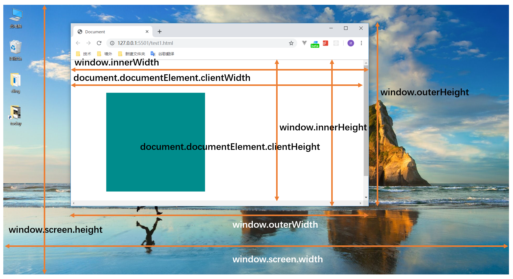
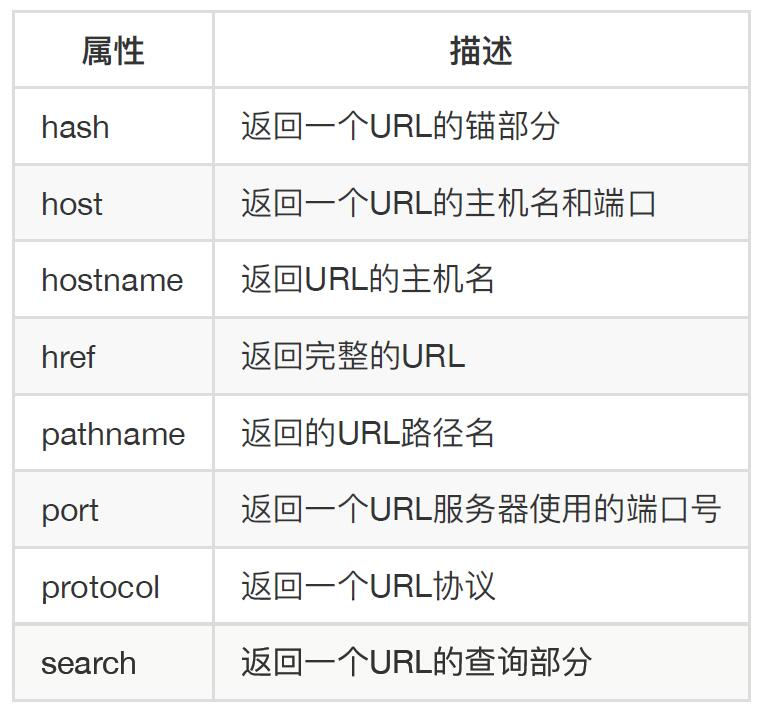
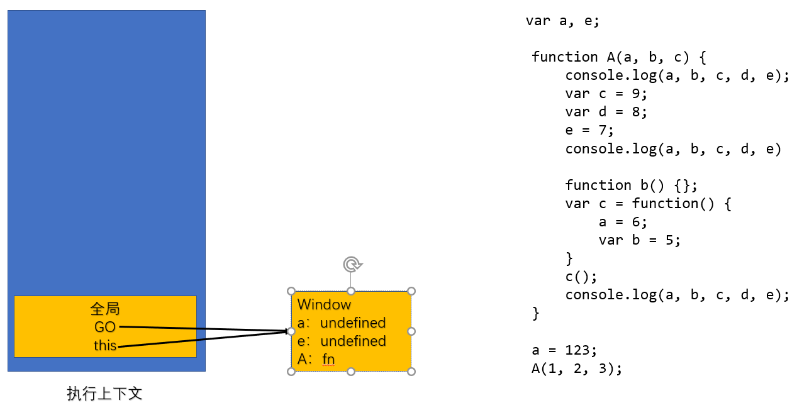
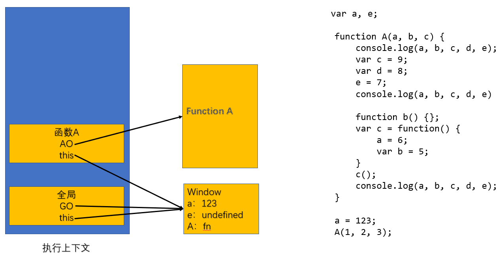
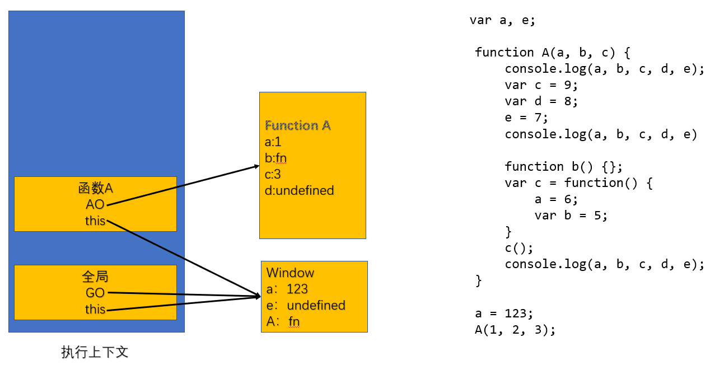
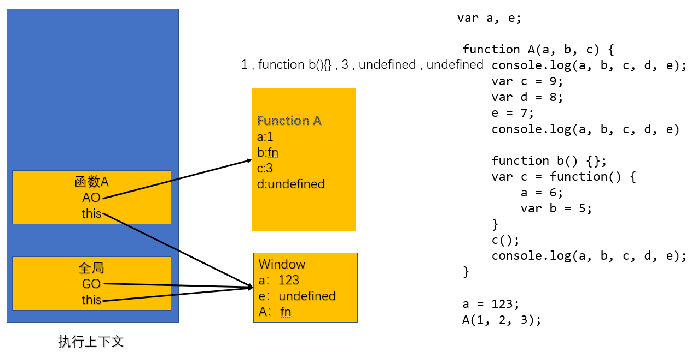
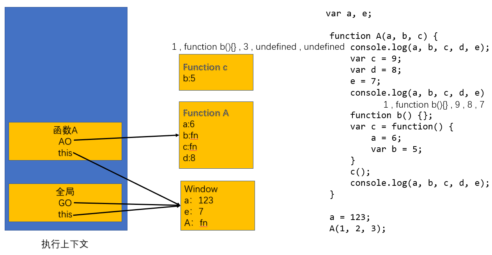
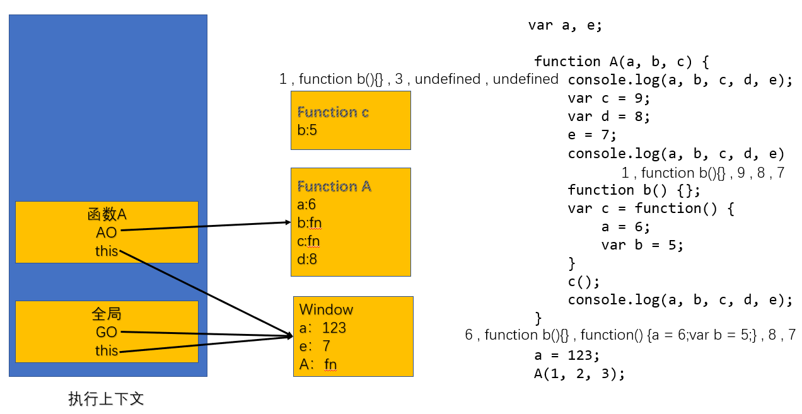
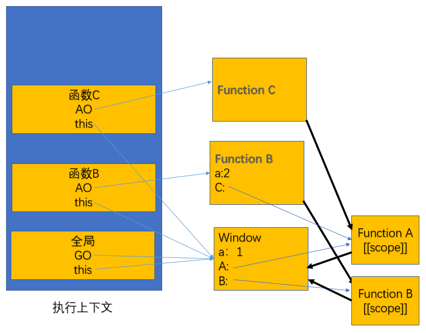

[toc]
# JS
**行为（`js`）** 结构（`html`）样式（`css`）相分离。
同步加载

## 基础

### 输出语句

#### `window.alert()`
使用`window.alert()`写入警告框
```js
window.alert(7 + 6);
```

---

#### `document.write()`
使用`document.write()`写入`HTML页面`输出
```js
document.write(7 + 6);
```
---

#### `innerHTML`
使用`innerHTML`写入`HTML元素`到页面中
```html
<p id="demo"></p>
<script>
    document.getElementById("demo").innerHTML = 7 + 6;
</script>
```

---

#### `console.log()`
使用`console.log()`写入浏览器控制台
```js
console.log(7 + 6);
```

---

### 输入语句

#### `prompt()`
弹出框输入框，等待用户输入，括号里可写提示文字
用户点`取消`返回`null`
用户`填写内容`点确定返回`填写内容的字符串`
用户`不填写`点确定返回`空字符串`

---
 
### 数据类型

#### 原始类型/基本类型
- **`number`：数字**
   - 直接书写
- **`string`：字符串**
   - 用单引号`''` 或双引号`""` 或` `` `括起来的，只有` `` `内可以换行。
   - `\`为转义字符，可以输出一些有特殊含义的字符。
  `\"`表示`"`
   `\\`表示`\`
   `\n`表示换行
   `\t`表示缩进一格
- **`boolean`：布尔值**
   - 表示`true`或`false`两个状态
- **`undefined`**
   - 表示不存在，无定义的
- **`null`**
   - 表示空，不存在

#### 引用类型
- **`object`：对象**
   - > { 
        &emsp;属性名:属性值, 
        &emsp;属性名:属性值, 
       }
   - >{
        &emsp;属性名:属性值, 
        &emsp;属性名:{
           &emsp;&emsp;属性名:属性值, 
           &emsp;&emsp;属性名:属性值, 
        &emsp;} 
       }

- **`array`：数组**
   - >[]
- **`function`：函数**
   - >function 函数名(参数) {
      }
      函数名(传参);

#### 打印的数据类型

##### `typeof()`
返回类型为string
```js
var a={
   name: "abc",
   pwd: "123123",
   man: false,
   age: 0,
   b: {
      name: "def"
   }
};
console.log(typeof 8);//number
console.log(typeof a);//object
console.log(typeof a.pwd);//string
console.log(typeof a.man);//boolean
console.log(typeof a.b);//object
console.log(typeof(1+2));//number
```

- `number`：number
- `string`：string
- `boolean`：boolean
- `undefined`：undefined
- `object`：object，null，array
- `function`：function

##### 区分返回值类型为object的object，null，array
```js
// 得到数据类型
function getType(a) {
   if (typeof(a) != "object") {
      console.log(typeof(a));
   } else {
      detailType(a);
   }
}

function detailType(a) {
   if (a instanceof Function) {
      console.log("function");
   } else if (a instanceof Array) {
      console.log("array");
   } else if (a instanceof Object) {
      console.log("object");
   } else {
      console.log("null");
   }
}
```

---

### 变量

#### `var`
声明变量
```js
var 变量名;

var a;
//此时变量a的值为undefined
```
#### 给变量赋值
```js
var a;
a = 8;
//此时变量a的值为数字8
```
- 给变量重复赋值，后面的值会覆盖前面的值
```js
var a;
a = 8;
a = "abc";
//此时变量a的值为字符串abc
```
- 变量可以存放所有数据类型
```js
var a;
a={
   name: "abc",
   pwd:"123123",
};
//此时变量a是一个对象
a.age = 18;
//给对象a添加一个属性age并赋值18
console.log(a.name);
//输出对象里的属性值时用 变量名.属性名
```
#### 命名规则
> **语法规范**
开头：`字母`，`_`，`$`
其他位置：`数字`，`字母`，`_`，`$`

> **常用规范**
望文知义
小驼峰命名法：首字母开头小写，第二个单词开头大写

```js
var rectangleWidth;//小驼峰，规范
```
#### 声明并赋值
*这是语法糖*
```js
var a = 8;
//此时变量a的值为数字8
```
#### 多个变量同时声明
*这是语法糖*
```js
var a = 8, b, c = 3;
```
#### 变量值复制
变量值被复制后原变量不会改变
```js
var a = 8;
var b = a;
//变量a的值为8，变量b的值也为8，互不影响
```
#### 用未声明的变量
- 用未声明的变量时*会报错*
- typeof未声明的变量时*会输出undefined*
```js
console.log(a);//a未声明会报错
console.log(typeof a);//输出undefined
```
#### js里会变量提升
所有变量声明会提到最顶部，赋值不会
```js
console.log(a, b);//会打印出undefined，undefined
var a = 1, b;
b = 2;
//如上代码等效于
var a;
var b;
console.log(a, b);//会打印出undefined，undefined
a = 1;
b = 2;
```

### 对象
####  声明变量，并给对象添加属性和属性值
```js
var a;
a={
   name: "abc",
   pwd:"123123",
};
//此时变量a是一个对象
a.age = 18;
//给对象a添加一个属性age并赋值18
```
#### 读取对象属性
`变量名.属性名`
```js
var a={
   name:"abc"
}
console.log(a.name);
//输出对象里的属性值时用
```
#### 属性复制
```js
var obj = {
   name: "",
   agr: 18,
   girlfriend: {
      name: "",
      age: 18
   }
};
var obj1 = {};
obj1.girlfriend = obj.girlfriend;
```
#### 读取未定义的属性
- 读取未定义的属性*会输出undefined*
- typeof未定义的属性*会输出undefined*
- 在一个空变量里读取一个未定义的属性*会报错*
```js
var obj={
   name:"abc"
}
console.log(obj.age);//输出undefined
console.log(typeof obj.age);//输出undefined

var obj1;
console.log(obj1.name);//报错

var obj1 = null;
console.log(obj1.name);//报错

var obj1 = {};
console.log(obj1.name);//输出undefined
```
#### `delete`
删除对象属性，一般不用
```js
var obj = {
   name: "",
   agr: 18,
   girlfriend: {
      name: "",
      age: 18
   }
};
delete obj.girlfriend;
```
#### 删除对象某属性值
将属性值用undefined覆盖，常用
```js
var obj = {
   name: "",
   agr: 18,
   girlfriend: {
      name: "",
      age: 18
   }
};
obj.girlfriend = undefined;
```
#### 属性表达式
`对象名["属性名"]` 可省略写成`对象名[属性名]` 
```js
var obj = {
   name: "",
   agr: 18,
   girlfriend: {
      name: "",
      age: 18
   }
};
console.log(obj["name"]);//输出name的属性值
//等同于  因为内部会将[]内转化为字符串
console.log(obj[name]);//输出name的属性值
```
- 可以把带有属性名的字符串放到变量里
```js
var obj = {
    name: "ABC",
    agr: 18,
    girlfriend: {
      name: "abc",
      age: 18
    }
};
var a = "name";
console.log(obj[a]);//ABC
```
#### 属性名命名
- 属性名是字符串，若是数字也会转换为字符串
- 望文知义，小写单词

#### `in`
关键字in判断对象中是否存在某属性，返回值布尔
`属性名 in 对象`
```js
var arr = [1, 2, 3, 4, 5, 6];//数组里面每一项的下标会作为属性名，每一项会作为属性值
console.log(5 in arr);//true
console.log(6 in arr);//false
```

---

### 数组
数组用来存放多个数据，数据可以是各种类型
#### 创建数组
- `new Array(数组长度)`：数组长度是个大于等于零的正数
```js
var arr = new Array(10);//创建了一个数组长度为10的空数组
```
- `new Array(数据1, 数据2, 数据3, ……)`：创建数组并初始化每一项的值
```js
var arr = new Array(1, 2, 3, 4);//创建了数组[1, 2, 3, 4]
```
- `[]`：直接创建数组
```js
var arr = [1, 2, 3, 4];//创建了数组[1, 2, 3, 4]
```
#### 数组属性
- `数组名.length`：数组长度
```js
var arr = [1, 2, 3, 4 ];
console.log(arr.length);//4
```
- `数组名[数组索引]`：访问数组某一项。数组第一项下标是零
```js
var arr = [1, 2, 3, 4 ];
console.log(arr[2]);//3
```
#### 数组某项赋值
`数组名[数组索引]=`
```js
var arr = [1, 2, 3, 4 ];
arr[2] = 10;
console.log(arr);//[1, 2, 10, 4 ]
```
#### 数组长度被赋值时
一般不要给数组长度赋值
如果数组本身长度大于给数组长度的赋值，则数组会按给的长度被截断
```js
var arr = [1, 2, 3, 4 ];
arr[20] = 10;//此时数组长度为二十，第十九项为10，第四项到第十八项都为空
arr.length = 10;//数组长度被截取为十，从第十项及之后的被截掉
console.log(arr);
```

#### 二维数组
```js
var arr = [
   [1, 2, 3],
   [4, 5, 6],
   [7, 8, 9]
];
```

---

#### 数组方法 

##### 添加数组项

###### `.push()`
向数组末尾添加一个或者多个数据
`数组名.push(添加的数据)`
```js
var arr = [1, 2, 3, 4 ];
arr.push("abc", 1);
console.log(arr);// [1, 2, 3, 4, "abc", 1]
```

###### `.unshift()`
向数组的起始项添加一个或多个数据，其他每项向后挪一位或多位
`数组名.unshift(添加的数据)`
```js
var arr = [1, 2, 3, 4];
arr.unshift("abc", 1);
console.log(arr);// ["abc", 1, 1, 2, 3, 4]
```

###### `.splice()`
在指定下标位置开始剪切掉零至几位，然后开始添加后面的数据
不想剪切的话写0，就代表只从第几位开始添加数据
返回值为删除的数据
`数组名.splice(指定下标,剪切0~x位,添加的数据可以是几项)`
```js
var arr = [1, 2, 3, 4];
arr.splice(2, 1, 10, 10);
console.log(arr);// [1, 2, 10, 10, 4]

var arr = [1, 2, 3, 4];
arr.splice(2, 0, 10, 10);
console.log(arr);// [1, 2, 10, 10, 3, 4]
```

##### 删除数组项

###### `delete`
数组这一项被移除为empty
`delete 数组名[数组项索引]`
```js
var arr = [1, 2, 3, 4];
delete arr[2];
console.log(arr);// [1, 2, empty, 4]
```

###### `.pop()`
删除数组最后一项
返回值最后一项数据
`数组名.pop()`
```js
var arr = [1, 2, 3, 4];
arr.pop();
console.log(arr);// [1, 2, 3]
```

###### `.shift()`
删除数组第一项
返回值第一项数据
`数组名.shift()`
```js
var arr = [1, 2, 3, 4];
arr.shift();
console.log(arr);// [2, 3, 4]
```

###### `.splice()`
在指定下标位置开始剪切掉零至几位，然后开始添加后面的数据
不想剪切的话写0，就代表只从第几位开始添加数据
返回值为删除的数据
`数组名.splice(指定下标,剪切0~x位,添加的数据可以是几项)`
```js
var arr = [1, 2, 3, 4];
arr.splice(2, 1, 10, 10);
console.log(arr);// [1, 2, 10, 10, 4]

var arr = [1, 2, 3, 4];
arr.splice(2, 0, 10, 10);
console.log(arr);// [1, 2, 10, 10, 3, 4]
```

##### 其他操作

###### `.slice()`
将起始位置到结束位置之间的数据复制出来成为新数组，不改变原数组
返回值为复制出的数据形成的新数组
常用作数组克隆
`数组名.slice(起始位置下标, 结束位置下标)`
得到完整数组
`数组名.slice()`
```js
var arr = [1, 2, 3, 4];
var newArr = arr.slice(1, 2);
console.log(arr, newArr); // [1, 2, 3, 4] [2]
```

###### `.indexOf()`
查找数组中数据，用恒等比较，找到第一个匹配的下标返回
如果没找到得到-1
`数组名.indexOf(数据)`
```js
var arr = [1, 2, 3, 4, 4];
var num = arr.indexOf(4);
console.log(arr, num); // [1, 2, 3, 4, 4] 3
```

###### `.lastIndexOf()`
查找数组中数据，用恒等比较，找到最后一个匹配的下标返回
`数组名.lastIndexOf(数据)`
```js
var arr = [1, 2, 3, 4, 4];
var num = arr.lastIndexOf(4);
console.log(arr, num); // [1, 2, 3, 4, 4] 4
```

###### `.fill()`
`数组名.fill(数据)`：将数组所有项填充为指定数据
`数组名.fill(数据, 开始下标)`：从数组指定的开始下标开始填充数据
`数组名.fill(数据, 开始下标, 结束下标)`：从数组指定的开始下标开始到结束下标前一个填充数据
```js
var arr = [1, 2, 3, 4, 5, 6];
arr.length = 10;
arr.fill(10);
console.log(arr);//[10, 10, 10, 10, 10, 10, 10, 10, 10, 10]
```

###### `.join()`
将数组每一项拿出来按指定分隔符进行拼接，返回拼接好的字符串，不改变原数组
`数组名.join(分隔符)`
```js
var arr = [1, 2, 3, 4, 5, 6];
var str = arr.join("$");
console.log(arr, str); //[1, 2, 3, 4, 5, 6] "1$2$3$4$5$6"
```

###### `.concat()`
拼接两个数组，返回拼接好的数组，不改变原数组
`数组1.concat(数组2)`
```js
var arr1 = [1, 2, 3, 4, 5, 6];
var arr2 = ["a", "b", "c"];
var arr3 = arr1.concat(arr2);
console.log(arr1, arr2, arr3); //[1, 2, 3, 4, 5, 6] ["a", "b", "c"] [1, 2, 3, 4, 5, 6, "a", "b", "c"]
```

---
#### 冒泡排序
```js
//从大到小
var arr = [1, 123, 4, 5, 89, 12, 34, 89, 2, 48, 69];
//从最后一位开始向前循环
for (var i = arr.length - 1; i >= 0; i--) {
    //如果后面大于前面的，交换
   if (arr[i] > arr[i - 1]) {
      var a;
      a = arr[i];
      arr[i] = arr[i - 1];
      arr[i - 1] = a;
      //后面的和前面的交换了，就有可能被换的数比后面的小
      //如[1,2,3] -> [1,3,2] -> [3,1,2]
      //所以要从最后一位开始重新向前循环比较
      i = arr.length;
   }
   //从后往前循环，保证每前一位大于后一位，那前面的一位一定大于后面所有位。
   //当有一位前面的小于后面的，交换，这时，不能继续向前比较。
   //要从最后一位重头向前比较，只要交换，就从最后一位重新开始
   //当从头到尾都是前一位大于后一位时，循环结束。
}
console.log(arr);//[123, 89, 89, 69, 48, 34, 12, 5, 4, 2, 1]
```

---

#### 抛出错误
`throw 错误对象`
错误对象的构造函数是Error
```js
throw new Error("xxxx是错误的");
```

#### 捕获错误
运行代码1出错时，转而执行代码2，错误对象为抛出的错误对象，再而执行代码3
```js
try{
   //代码块1
}
catch(错误对象){
   //代码块2
}
finally{//可省略
   //代码块3
}
```
例子：
```js
function A() {
   try {
      B();
      console.log("A");
   } catch (err) {
      C();
   }
}

function B() {
   throw new Error("xxxx是错误的");
}

function C() {
   console.log("C");
}

A(); //C
```

---

### 函数

#### 函数字面量会提升
函数字面量会提升到脚本块的顶部，和变量一样
所以调用可以再在函数声明前面
```js
//调用函数
函数名(传参);

//函数声明
function 函数名(参数){
   //代码块
}
```

#### 函数作用域
函数运行后，内部不使用var声明的变量，会附着在window的对象上
```js
function example(){
   a = 3;
}
example();//运行后，window对象上有个a属性为3
```
函数运行后，内部变量使用var声明，变量会提升到函数的顶部，函数外部不存在这个变量
就是说函数内部的变量和外部的变量不冲突，重名也不是同一个，函数内部的变量只能在内部用
```js
var a = 5;
function example(){
   var a = 3;
}
example();//运行后，函数外部的a是5，函数内部的a是3，互不干扰
```

#### 参数
形参不用声明，调用函数的时候，把实参的值带进去
如果没有实参传进去则为undefined
```js
function 函数名(形参){
   //代码块
}

函数名(实参);
```

#### 返回值
`return`关键字
运行到return会直接返回需要的值并结束函数的运行
不写return，函数的返回值是undefined
```js
function add(a){
   //代码块
   return a+a;
};

console.log(add(1));//2
```

#### 立即执行函数
将正常函数用`()`包起变成一个表达式，后写`()`函数立即执行一次，
执行完后会销毁函数作用域，并且再也找不到这个函数，所以可以省略函数名不写
```js
(function (){
   //代码块
})()
```

#### 函数表达式
函数没有提升
把函数的值赋值给变量
```js
var a = function (){
   //代码块
};
```
任何地方能放值的地方，都能放函数

#### this关键字
在全局作用域中，this指向windows对象
在函数作用域中，函数直接调用this指向windows对象
在函数作用域中，函数被保存到对象的属性中，通过对象属性调用`对象名.属性名()` `对象名[属性名]()`，this指向这个对象

#### 回调函数
在函数里把函数名作为参数传进去调用该传参函数
```js
//把数组按照某种要求是筛选，组成新数组返回
function odd(a, callback) {//callback形参名，等待从传递的是函数名
   var arr = [];
   for (var i = 0; i < a.length; i++) {
      if (callback(a[i])) {//callback调用函数
         arr.push(a[i]);
      }
   }
   return arr;
}

var arr = [1, 23, 6, 56, 3];

//调用odd函数，把数组和筛选方法的函数名传进去
console.log(odd(arr, isOdd));//[1, 23, 3]

//需要用到的筛选方法的函数
function isOdd(n) {
   return n % 2 !== 0;
}
```
```js
//把数组按照某种要求是筛选，组成新数组返回
function odd(a, callback) {//callback形参名，等待从传递的是函数名
   var arr = [];
   for (var i = 0; i < a.length; i++) {
      if (callback(a[i])) {//callback调用函数
         arr.push(a[i]);
      }
   }
   return arr;
}

var arr = [1, 23, 6, 56, 3];

//调用odd函数，把数组和筛选方法的函数传进去
console.log(odd(arr, function (n) {
   return n % 2 !== 0;
}));//[1, 23, 3]
```

#### 构造函数
用于创建对象的函数
可以减少繁琐的对象创建流程
调用构造函数：`new 函数名(参数);`
>大驼峰命名法

>用关键字new调用

>构造函数内部会自动创建新对象，this指向新创建的对象，并自动返回新对象
```js
function User(name, age){
      this.name = name;
      this.age = age;
      this.sayhellow = function(){
         console.log(`我叫${this.name}，我今年${this.age}岁`);
      }
}

var u1 = new User("小王", 18);
u1.sayhellow();
```
```js
//这是一般写法，不是构造函数写法，作用与上面相同
function creatObj(name, age){
   return {
      name:name,//语法糖可简写为name;
      age:age,
      sayhellow:function(){//语法糖可简写为sayhellow(){}
         console.log(`我叫${name}，我今年${age}岁`);
      }
   }
}

var u1 = creatObj("小王", 18);
u1.sayhellow();
```

##### `new.target`
通常用于判断是否使用new关键字来调用，不用new关键字调用构造函数会报错，这里判断一下做处理
```js
function User(name, age){
   var func=function(){
      console.log(`我叫${this.name}，我今年${this.age}岁`);
   }
   if(new.target===User){
      //正常构造函数调用方法
      this.name = name;
      this.age = age;
      this.sayhellow = func();
   }else{
      //用普通函数方法调用
      return {
         name,
         age,
         sayhellow:func(),
      }
   }
}
var u1 = new User("小王", 18);
var u2 = User("小李", 63);
u1.sayhellow();
u2.sayhellow();
```

#### 包装类
为增强原始类型的功能，为Number，String，Boolean创建了构造函数。当把原始类型像对象那样使用属性时，js会利用相应的构造函数创建对象以供原始类型访问属性
>成员属性(方法)/实例属性(方法)：该属性是通过**构造函数创建的对象**调用的

>静态属性(方法)/类属性(方法)：该属性是用过**构造函数本身**调用的

---

### window对象
全局有一个对象，是window，我们所用的console等，都是window的属性，我们自己定义的变量，都是放进window的属性里

---

### 基本类型和引用类型的内存空间
基本类型是在内存中放值，复制时将值复制过来，两个变量的值互不影响。
```js
var num1 = 5;
var num2 = num1;
num2 = 6;//不影响
```


---

引用类型将值存在别的的地方，在内存中放存东西的地址，复制时复制地址，改变值则都改变。
```js
var obj1 = {
   name: "abc"
}
var obj2 = obj1;
obJ2.name = "def";//影响
```


若重新建了对象字面量对同名属性进行更改，则对象会指向新地址，与原有地址的东西毫无关系
```js
var obj1 = {
   name: "abc"
}
var obj2 = obj1;
obj2 = {
   name: "def" //不影响
}
```

---
练习：
```js
var obj1 = {
   a: "123",
   b: "456",
   sub:{
      s1: "abc",
      s2: "def"
   }
};
var temp = obj1.sub;
var obj2 = obj1;
obj2.sub = {
   s1: "aaa",
   s2: "bbb"
};
console.log(obj1.sub.s1, obj2.sub.s1, temp.s1)//aaa aaa abc
```

---

## 运算符

### 表达式
- `=`：赋值表达式，返回赋值结果
- `.`：属性访问表达式，返回属性的值
- `[]`：属性访问表达式，返回属性的值
- `()`：函数调用表达式，返回函数运行的结果

console.log()的返回值是undefined
声明语句，声明加赋值语句的返回值都是undefined

```js
//例题
let a = {
    n: 1
};
let b = a;
a.x = a = {
    n: 2
}
console.log(a.x);// undefined
console.log(b);// {n: 1, x: {n:2}}
console.log(a);// {n: 2}
计算是从左到右，先计算第一个等号，拿到第一个等号右边的值的返回结果赋值给第一个左边的东西。
再计算第二个等号，第二个等号右边的值赋值给第二个等号左边的东西
```

---

### 算数运算符
- `+ - * /`：加 减 乘 除
0/0：NAN
正数/0：Infinity
负数/0：-Infinity
- `+ -`：正 负
- `%`：求余
任何数%0：NAN
求余的正负号只和被除数有关
- `++`：变量值自增1
```js
var a = 1;
//a=a+1  先使用a，再a加一
a++;//1
a;//2
```
```js
var a = 1;
//a=a+1  先a加一，再使用a
++a;//2
a;//2
```
常量运算++/--会报错，NAN不会报错还是NAN，infinity运算后还是infinity
```js
var a;//a为undefined
a++;//undefined转数字为NAN，NAN++为NAN
```
- `--`：变量值自减1
- `**`：幂运算
```js
5**2：25
```
- `+=`：复合赋值运输算符
```js
var x = 3;
x += 3;//x=x+3
console.log(x);//6
```
- `*=`：复合赋值运输算符
```js
var x = 3;
x *= 2 + 3;//x=x*（2+3）
console.log(x);//15
```
练习：
```js
var a = 1;
a + a++ * ++a;//1+1*3
var b = 1;
b++ + ++b + b++ * ++b + ++b;//1+3+3*5+6
```

#### `.isNaN()`
判断数据是否是NAN，返回布尔值
```js
isNaN(NAN);//true
```

#### `.isFinite()`
判断数据是否是有限的，返回布尔值
```js
isFinite(1);//true
isFinite(Infinity);//false
isFinite(NAN);//false
```

#### 非加号进行算数运算
运算优先级：正号>加加减减>乘除求余>加减
优先级相同，从左到右运算，遇到括号先算括号
##### 转数字
- boolean：true -> 1 , false ->0
```js
true + false;//1+0=1
```
- string：带有正号的为转化为数字，正号优先级很高
如果字符串内是数字，则转换为数字，
如果不是数字，则转换为NAN，
如果是空字符串，则转换为0，前后有空格时会忽略空格，中间空格不会忽略。
"undefined" -> NAN
"infinity" -> NAN
   - NAN和任何数字运算，都是NAN
```js
"abc" - 123;//NAN
"123" - 3;//123-3=120
"infinity" - 0;//NAN
"undefined" - 0;//NAN
"NAN" - 0;//NAN
"" - 1;//-1
"     " - 1;//-1
"              3" -1;//3-1=2
+"3" + 1;//3+1+4
(+"3") + 1;//3+1+4
+"  1  1" ;//NAN

"123"+3;//"1233"

var a = "123";
console.log(+a, typeof +a);//123 "number" 
```
- null：+null -> +0 , -null -> -0
```js
null + null;//0+0=0
```
- undefined：undefined -> NAN
```js
undefined + 1;//NAN
```
- 对象：NAN，对象进行除加号外的运算，都是NAN。
```js
var obj={};
obj - 1;//NAN
```

#### 含字符串加号进行拼接
- 加号两边有字符串，为字符串拼接
```js
"abc" + "def";//"abcdef"
```
- 加号一边有字符串，另一边会转换为字符串类型进行拼接
```js
"abc" + 123;//"abc123"
"abc" + null;//"abcnull"
"" + null;//"null"
"" + undefined;//"undefined"
"123" + 3;//"1233"
```
- 对象会转换为[object Object]
```js
var obj={};
obj + 1;//"[object Object]1"

var a;
a + {} + 123;//"undefined[object Object]123"
```

---

### 比较运算符
返回类型是布尔
算数运算符的优先级大于比较运算符
- `>`：大于
- `<`：小于
- `>=`：大于等于
- `<=`：小于等于
   - 两个都是字符串，进行ASCII码比较。比较大小是逐个比较ASCII编码，如“12”和“13”，两个“1”的编码进行比较，相等再比较“2”和“3”
   - 只要有一个不是字符串则转化为数字进行比较
   - NAN与任何数字比较，得到的都是false
   - infinity比任何数字都大
   - -infinity比任何数字都小
- `==`：相等
   - 两端数据类型相同，比较两个数据是否相等
      - 对象的话是比较地址是否相等
      ```js
      var a = {};
      var b = {};
      console.log(a == b);//false
      ```
      - NAN和任何数字比较都是false，包括自身
      ```js
      console.log(NAN == NAN);//false
      ```
      - infinity和-infinity只能和自身相等
      ```js
      console.log(infinity == infinity);//true
      ```
   - 两端数据类型不相同
      - null和undefined相等
      ```js
      console.log(null == undefined);//true
      ```
      - null和undefined和其他任何类型的值比较都不相等
      ```js
      console.log(null == 0);//false
      ```
      - 除了null和undefined之外，其他类型都是转换为数字进行比较
      ```js
      console.log(true = 1);//true
      console.log([] == ![]);//true ![]为false，[]==false，不同类型要转换为数字比较，[]为0，false为0 
      ```
- `!=`：不相等
比较两个数据是否不相等
- `===`：恒等
   - 两端数据类型相同，比较两个数据是否相等
      - 对象的话是比较地址是否相等
      - NAN和任何数字比较都是false，包括自身
      - infinity和-infinity只能和自身相等
   - 两端类型不同，则为false
- `!==`：不恒等
两个数据或是数据类型不一样就不恒等

---

### 逻辑运算符
>以下类型都判定为false：
null，undefined，false，NAN，""（空字符串，里面不能有空格），0
其他全判定为true

- `&&`：与。**从左向右，返回第一个表达式为假的结果，没有判定为假的表达式则返回最后一个表达式的结果**
`表达式1 && 表达式2`
从左到右判定，`表达式1`为`假`直接返回`表达式1`的结果，`表达式1`为`真`就返回`表达式2`的结果，依次向后
```js
console.log(5 > 3 && 100);//100
```

- `||`：或。**从左向右，返回第一个表达式为真的结果，没有判定为真的表达式则返回最后一个表达式的结果**
`表达式1 || 表达式2`
从左向右判定，`表达式1`为`真`直接返回`表达式1`的结果，`表达式1`为`假`就返回`表达式2`的结果，依次向后

- `！`：非。将判定结果直接取反，必返回布尔值
---

### 三步运算符
`表达式1 ? 表达式2 : 表达式3`
`表达式1`结果为`真`返回`表达式2`的结果，`表达式1`结果为`假`返回`表达式3`的结果

---

### 模板字符串
` `` `：模板字符串
`${}`：里面放js表达式
```js
var obj={
   name:"abc",
   age:18
};
console.log(`我叫${obj.name}，我今年${obj.age}岁了`);
```

---

### `void运算符`
建议函数写法，因为他的优先级很高，表达式会被拆开
一般写法：`void 表达式`
函数写法：`void(表达式)`
运行表达式并返回undefined
```js
void 1+2;//undefined+2->NAN
void(1+2);//undefined
void 1;//undefined
```

---

### `typeof运算符`
建议函数写法，因为他的优先级很高，表达式会被拆开
一般写法：`typeof 表达式`
函数写法：`typeof(表达式)`
```js
typeof 1+2;//"number2"
typeof(1+2);//"number"
```
---

### 逗号运算符
从左到右每个表达式运算一遍，返回最后一个逗号后面的表达式的值
```js
var x = 1;
x = (x++-3, ++x+3, x++*3, --x+3);//6
```
优先级很低，比等号还要低
```js
var x = 1;
x = x++-3, ++x+3, x++*3, --x+3;//2
//逗号优先级很低，所以先算了x=x++-3，x=1-3=-2
//再算第二个逗号里++x+3=-1+3 此时x=-1
//再算第三个逗号里x++*3=-1*3 此时x=0
//再算最后一个表达式--x+3=-1+3=2
```

---

## 流程控制

### `if`
```js
if(条件1){//是否满足条件1

//满足条件1执行此

}else if(条件2){//不满足条件1在此判断是否满足条件2

//满足条件2执行此

}else if(条件3){//不满足条件2在此判断是否满足条件3

//满足条件3执行此

}else{//不满足条件3

//执行此

}
```

---

#### `Math.random()`
得到一个(0,1)的随机数
```js
console.log(Math.random());
```

---

### `switch`
```js
switch(表达式){//计算表达式
   case 数据1://数据1和表达式的值是否恒等，恒等依次执行下面代码块直至遇到break，不恒等就比较数据2，依次向下
      代码块
      break;
   case 数据2:
      代码块
      ……
   default://前面数据和表达式的值都不匹配，运行此处代码块
      代码块
}
```

---

### 循环
`break`：跳出循环（只跳出离它最近的那一个循环）
`continue`：停止当前循环，进入下一次循环

#### `while`
```js
while(条件){//当条件满足时                   判断<—————————————
   代码块//运行代码块，再从头判断条件是否满足  运|行             |
   循环体                                     |              |
}                                             ———————————————
//条件不满足跳出循环
```

#### `do-while`
```js
do{//运行代码块                                      运|行<——————
代码块                                                |         |
循环体                                                |         |
}while(条件);//判断条件是否满足，满足从头去运行代码块    判断———————
//条件不满足跳出循环
```

#### `for`
```js
for(初始条件 ;判断条件 ;改变循环条件 ){ //i=0;i<10;i++
代码块// 初始条件，执行代码块，改变循环条件，判断条件——
}                    个__________________________ |
```

#### `for-in`
取出对象的所有属性名，每次循环将其中一个属性名赋值给变量，运行代码块
```js
for(变量名 in 对象){
//代码块
}
```


#### 数组的遍历
- for-in循环可以用来对数组遍历
```js
var arr = [1, 2, 3, 4, 5, 6];
for(var index in arr){
   console.log(index, arr[index]);//0 1
                                  //1 2
                                  //2 3
                                  //3 4
                                  //4 5
                                  //5 6
}
```
- for循环可以用来对数组遍历
```js
var arr = [1, 2, 3, 4, 5, 6];
for(var i = 0; i<arr.length; i++){
   console.log(arr[i]);
}
```
> for-in循环和for循环对数组的遍历的区别
**for-in循环**不会遍历到稀松数组，为empty的位置不会被遍历到，因为他是用属性名进行的遍历，为empty的位置下标不会成为属性名。
**for循环**会遍历到疏松数组，他是按数组长度遍历每一个下标，为empty的位置遍历出来会是undefined。

---

## 标准库/API

### Object
https://developer.mozilla.org/zh-CN/docs/Web/JavaScript/Reference/Global_Objects/Object

#### 静态方法

##### `Object.keys()`
**返回**一个包含所有给定对象自身可枚举**属性名称**的**数组**。
```js
var obj = {
   name:"csdc",
   age:15
}
var arr = Object.keys(obj);
console.log(arr); //["name", "age"]
```

##### `Object.values()`
**返回**给定对象自身可枚举**值**的**数组**。
```js
var obj = {
   name: "csdc",
   age: 15
}
var arr = Object.values(obj);
console.log(arr); //["csdc", 15]
```

##### `Object.entries()`
**返回**给定对象自身可枚举属性的 **[key, value]数组**。
```js
var obj = {
   name: "csdc",
   age: 15
}
var arr = Object.entries(obj);
console.log(arr); //[["name", "csdc"], ["age", 15]]
```

#### 实例方法
所有引用类型，都有Object的实例方法
实例方法都可以被重写
```js
var obj = {
   name: "csdc",
   age: 15,
   toString() {
   return "123";
   }
}
console.log(obj.toString()); //"123"
```
##### `.toString()`
**返回字符串**代表示此对象的源码形式，可以使用此字符串生成一个新的相同的对象。
```js
var obj = {
   name: "csdc",
   age: 15
}
console.log(obj.toString());//[object Object]

arr = ["cds", 65, 2, "wr", false];
console.log(arr.toString()); //"cds,65,2,wr,false"
```

##### `.valueOf()`
**返回**指定对象的**原始值**。
```js
var obj = {
   name: "csdc",
   age: 15
}
console.log(obj.valueOf()); //{name: "csdc", age: 15}

arr = ["cds", 65, 2, "wr", false];
console.log(arr.valueOf()); //["cds", 65, 2, "wr", false]
```

> 有运算符自动转换时，是内部先调用valueOf()后如果没有得到原始类型再接着调用toString()。

---

### Function
https://developer.mozilla.org/zh-cn/docs/web/javascript/reference/global_objects/function

#### 关键字

##### `arguments`
以**数组形式**获取**所有实参**。
得到的是**伪数组**。
```js
function exp(a, b) {
    console.log(arguments); //[63, 96, 33, 22]
}
exp(63, 96, 33,22);
```

#### 实例成员

##### `.length`
得到函数的**形参个数**
```js
function exp(a, b) {

}
console.log(exp.length); //2
```

#### 实例方法

##### `.apply()`
**调用函数**并**指定this指向**
```js
function getName() {
    console.log(this.name)
}
var u1 = {
    name: "abc"
}
getName.apply(u1);//abc
```
当调用的函数有参数时，把参数写在数组里
```js
function getName(a, b) {
    console.log(this.name)
    ......
}
var u1 = {
    name: "abc"
}
getName.apply(u1, [1, 2]);//abc
```

##### `.call()`
**调用函数**并**指定this指向**
```js
function getName() {
    console.log(this.name)
}
var u1 = {
    name: "abc"
}
getName.call(u1);//abc
```
当调用的函数有参数时，把参数直接写在后面
```js
function getName(a, b) {
    console.log(this.name)
    ......
}
var u1 = {
    name: "abc"
}
getName.apply(u1, 1, 2);//abc
```

- `apply()`和`call()`可以将伪数组转化为真数组
`[].slice.apply()`
```js
function getName() {
    var newArr = [].slice.apply(arguments);
    console.log(newArr); //[5, 153, 5, 1, 3, 5, 6, 15, 4]
}
getName.call(13, 5, 153, 5, 1, 3, 5, 6, 15, 4);
```

##### `.bind()`
**得到一个新函数**并且**this始终指向指定的值**
```js
function getName() {
    console.log(this.name)
}
var u1 = {
    name: "abc"
}
var newFunc = getName.bind(u1);
newFunc();
```

---

### Array
https://developer.mozilla.org/zh-CN/docs/Web/JavaScript/Reference/Global_Objects/Array

#### 静态方法

##### `Array.from()`
将**假数组转换为真数组**
```js
function getName() {
    var newArr = Array.from(arguments);
    console.log(newArr); //[2, 3, 2, 5, 9, 4]
}
getName(2, 3, 2, 5, 9, 4);
```

##### `Array.isArray()`
**判断**给定的数据是**否为真数组**
```js
function getName() {
    var newArr = Array.from(arguments);
    console.log(Array.isArray(newArr)); //true
    console.log(Array.isArray(arguments)); //false
}
getName(2, 3, 2, 5, 9, 4);
```

#### 实例方法

##### 改变原数组

###### `.push()`
向数组**末尾添加一个或者多个数据**
```js
var arr = [1, 2, 3, 4 ];
arr.push("abc", 1);
console.log(arr);// [1, 2, 3, 4, "abc", 1]
```

###### `.unshift()`
向数组的**起始项添加一个或多个数据**，其他每项向后挪一位或多位
```js
var arr = [1, 2, 3, 4];
arr.unshift("abc", 1);
console.log(arr);// ["abc", 1, 1, 2, 3, 4]
```

###### `.splice()`
在**指定下标**位置开始**剪切**掉零至几位，然后开始**添加**后面的数据
不想剪切的话写0，就代表只从第几位开始添加数据
返回值为删除的数据
```js
var arr = [1, 2, 3, 4];
arr.splice(2, 1, 10, 10);
console.log(arr);// [1, 2, 10, 10, 4]

var arr = [1, 2, 3, 4];
arr.splice(2, 0, 10, 10);
console.log(arr);// [1, 2, 10, 10, 3, 4]
```

###### `.pop()`
**删除数组最后一项**
返回值最后一项数据
```js
var arr = [1, 2, 3, 4];
arr.pop();
console.log(arr);// [1, 2, 3]
```

###### `.shift()`
**删除数组第一项**
返回值第一项数据
```js
var arr = [1, 2, 3, 4];
arr.shift();
console.log(arr);// [2, 3, 4]
````

###### `.fill()`
将**数组所有项填充为指定数据**
从数组指定的开始下标开始填充数据
从数组指定的开始下标开始到结束下标前一个填充数据
```js
var arr = [1, 2, 3, 4, 5, 6];
arr.length = 10;
arr.fill(10);
console.log(arr);//[10, 10, 10, 10, 10, 10, 10, 10, 10, 10]
```

###### `.reverse()`
**颠倒数组顺序**并**改变原数组**
```js
var arr = [2, 3, 2, 5, 9, 4];
var newArr = arr.reverse();
console.log(arr); //[4, 9, 5, 2, 3, 2]
console.log(newArr); //[4, 9, 5, 2, 3, 2]
```

###### `.sort()`
**默认对数组按字符串编码**进行**排序**，**改变原数组**
```js
var arr = [2, 3, 2, 5, 9, 4];
var newArr = arr.sort();
console.log(arr); //[2, 23, 3, 4, 5, 9]
console.log(newArr); //[2, 23, 3, 4, 5, 9]
```
可以传函数进去，那么数组会按照调用该函数的返回值排序。即 a 和 b 是两个将要被比较的元素：
如果 compareFunction(a, b) 小于 0 ，那么 a 会被排列到 b 之前。
如果 compareFunction(a, b) 等于 0 ， a 和 b 的相对位置不变。
如果 compareFunction(a, b) 大于 0 ， b 会被排列到 a 之前。
具体见：https://developer.mozilla.org/zh-CN/docs/Web/JavaScript/Reference/Global_Objects/Array/sort
```js
var arr = [23, 3, 2, 5, 9, 4];
var newArr = arr.sort(function compare(a, b) {
   if (a < b) {
      return -1;
   }
   if (a > b) {
      return 1;
   }
   return 0;
});
console.log(newArr); //[2, 3, 4, 5, 9, 23]
```
随机打乱数组：
```js
var arr = [23, 3, 2, 5, 9, 4];
var newArr = arr.sort(function compare(a, b) {
    return Math.random() - 0.5;
});
console.log(newArr);
```

##### 不改变原数组

###### `.join()`
将**数组每一项**拿出来**按指定分隔符进行拼接**，**返回拼接好的字符串**，**不改变原数组**
```js
var arr = [1, 2, 3, 4, 5, 6];
var str = arr.join("$");
console.log(arr, str); //[1, 2, 3, 4, 5, 6] "1$2$3$4$5$6"
```

###### `.concat()`
**拼接**两个数组，**返回拼接好的数组**，**不改变原数组**
```js
var arr1 = [1, 2, 3, 4, 5, 6];
var arr2 = ["a", "b", "c"];
var arr3 = arr1.concat(arr2);
console.log(arr1, arr2, arr3); //[1, 2, 3, 4, 5, 6] ["a", "b", "c"] [1, 2, 3, 4, 5, 6, "a", "b", "c"]
```

###### `.indexOf()`
**查找**数组中**数据**，**用恒等比较**，找到**第一个匹配的下标**返回
如果没找到得到-1
```js
var arr = [1, 2, 3, 4, 4];
var num = arr.indexOf(4);
console.log(arr, num); // [1, 2, 3, 4, 4] 3
```

###### `.lastIndexOf()`
**查找**数组中**数据**，用**恒等比较**，找到**最后一个匹配的下标**返回
```js
var arr = [1, 2, 3, 4, 4];
var num = arr.lastIndexOf(4);
console.log(arr, num); // [1, 2, 3, 4, 4] 4
```

###### `.includes()`
判断**是否包含指定数据**，第二个参数指从什么位置开始找
```js
var arr = [1, 2, 3, 4, 7, 52, 6];
console.log(arr.includes(7, 6));//false
console.log(arr.includes(7));//true
```

###### `.slice()`
将**起始位置**到**结束位置**之间的数据**复制**出来成为**新数组**，**不改变原数组**
返回值为复制出的数据形成的新数组
常用作数组克隆
```js
var arr = [1, 2, 3, 4];
var newArr = arr.slice(1, 2);
console.log(arr, newArr); // [1, 2, 3, 4] [2]
```

##### 迭代方法，不改变原数组

###### `.forEach()`
**遍历数组**
forEach(function(数组每一项,数组下标,整个数组){ })
```js
var arr = [1, 2, 3, 4, 7, 52, 6];
arr.forEach(function(item, i, arr) {
   console.log(item, i, arr)
});
//1 0 (7) [1, 2, 3, 4, 7, 52, 6]
//2 1 (7) [1, 2, 3, 4, 7, 52, 6]
//3 2 (7) [1, 2, 3, 4, 7, 52, 6]
//4 3 (7) [1, 2, 3, 4, 7, 52, 6]
//7 4 (7) [1, 2, 3, 4, 7, 52, 6]
//52 5 (7) [1, 2, 3, 4, 7, 52, 6]
//6 6 (7) [1, 2, 3, 4, 7, 52, 6]
```

###### `.every()`
判断**是否所有都满足**
```js
var arr = [1, 2, 3, 4, 7, 52, 6];
var result = arr.every(function(item) {
   return item > 5;
});
console.log(result);//false
```

###### `.some()`
判断**是否有一个满足**
```js
var arr = [1, 2, 3, 4, 7, 52, 6];
var result = arr.some(function(item) {
   return item > 5;
});
console.log(result); //true
```

###### `.filter()`
**过滤满足条件的数组，返回新数组，不改变原数组**
```js
var arr = [1, 2, 3, 4, 7, 52, 6];
var newArr = arr.filter(function(item) {
   return item > 5;
});
console.log(newArr); //[7, 52, 6]
```

###### `.find()`
找到**第一个满足条件的返回元素本身**，然后停止查找，**如果没找到返回undefined**
```js
var arr = [1, 2, 3, 4, 7, 52, 6];
var result = arr.find(function(item) {
   return item > 5;
});
console.log(result); //7
```

###### `.findIndex()`
找到**第一个满足条件的返回元素下标**，然后停止查找，**如果没找到返回-1**
```js
var arr = [1, 2, 3, 4, 7, 52, 6];
var result = arr.findIndex(function(item) {
   return item > 5;
});
console.log(result); //4
```

###### `.map()`
将数组每一项**映射**成另一项
```js
var arr = [1, 2, 3, 4, 7, 52, 6];
var result = arr.map(function(item, i) {
   return {
      name: "user" + (i + 1),
      age: item
   }
});
console.log(result); //[{name: "user1", age: 1},{name: "user2", age: 2},{name: "user3", age: 3},{name: "user4", age: 4},{name: "user5", age: 7},{name: "user6", age: 52},{name: "user7", age: 6}]
```

###### `.reduce()`
回调函数中，首先将数组前两项传入，运算后将运行的结果作为后一次运行的第一个参数传进，第二个参数是数组的第三项
```js
var arr = [1, 2, 3, 4, 5, 6, 7, 8, 9, 10];
var result = arr.reduce(function(a, b) {
   console.log(a, b); //1 2|3 3|6 4|10 5|15 6|21 7|28 8|36 9|45 10
   return a + b;
});
console.log(result); // 55
```
当不只有回调函数一个参数时，第二个参数作为回调函数的第一个参数传入
```js
var arr = [1, 2, 3, 4, 5, 6, 7, 8, 9, 10];
var result = arr.reduce(function(a, b) {
   console.log(a, b); //0 1|1 2|3 3|6 4|10 5|15 6|21 7|28 8|36 9|45 10
   return a + b;
}, 0);
console.log(result); // 55
```

---

### 包装器
原始类型的构造函数
- `new Number(值)`：将其他类型值转换为数字，返回一个对象，不能转换时为NAN
- `new Boolean(值)`：将其他类型值转换为布尔，返回一个对象
- `new String(值)`：将其他类型值转换为字符串，返回一个对象
```js
var a = "231nj";
console.log(new Number(a)); //Number {NaN}
console.log(new Boolean(a)); //Boolean {true}
console.log(new String(a)); //String {"231nj"}
```
</br>

- `Number(值)`：将其他类型值转换为数字，返回原始类型，不能转换时为NAN
- `Boolean(值)`：将其他类型值转换为布尔，返回原始类型
- `String(值)`：将其他类型值转换为字符串，返回原始类型
```js
var a = "231nj";
console.log(Number(a)); //NAN
console.log(Boolean(a)); //true
console.log(String(a)); //"231nj"
```

---

#### Number
https://developer.mozilla.org/zh-CN/docs/Web/JavaScript/Reference/Global_Objects/Number

##### 静态方法
部分被挂在windows里，可以直接使用，不用`Number.isNaN()`

###### `isNaN()`
判断是否是NAN
```js
var a = 23;
console.log(isNaN(a)); //false
```

###### `isFinite()`
判断数字是否有限
```js
var a = 23;
console.log(isFinite(a)); //true
```

###### `Number.isInteger()`
判断是否是整数
```js
var a = 23.0;
console.log(Number.isInteger(a)); //true
```

###### `parseFloat()`
将一个数据提取其中小数
```js
var a = 23.9;
console.log(parseFloat(a)); //23.9
var b = "23.9cvsdv";
console.log(parseFloat(b)); //23.9
var c = "ihbh23.9cvsdv";
console.log(parseFloat(c)); //NAN
```

###### `parseInt()`
将一个数据提取其中整数，向下取整。如果有第二个参数，第二个参数为按照指定禁止转换
```js
var a = 23.9;
console.log(parseInt(a)); //23
var b = "23.9cvsdv";
console.log(parseInt(b)); //23
var c = "ihbh23.9cvsdv";
console.log(parseInt(c)); //NAN
```

##### 实例方法

###### `.toFixed()`
保留指定位数进行保留小数，会四舍五入
```js
var a = 12.396;
console.log(a.toFixed(2));//12.40
```

###### `.toPrecision()`
保留指定有效数字
```js
var a = 12.396;
console.log(a.toPrecision(3)); //12.4
```

---

#### Boolean
https://developer.mozilla.org/zh-CN/docs/Web/JavaScript/Reference/Global_Objects/Boolean

##### 实例方法

###### `.toString()`
转换为字符串
```js
var a = false;
console.log(a.toString()); //"false"
```

---

#### String
https://developer.mozilla.org/zh-CN/docs/Web/JavaScript/Reference/Global_Objects/String

字符串内换行用`\`再换行，并不会真正换行，只用于代码书写方便易查看

##### 静态方法

###### `String.fromCharCode()`
按Unicode创建字符串
```js
var a = 1;
console.log(String.fromCharCode(a));//
```

##### 实例成员

###### `.length`
得到**字符串的长度**
字符串是一个伪数组，可以循环
```js
var str = "vbfvnsflnl";
console.log(str.length);//10
for (var i = 0; i < str.length; i++) {
   console.log(str[i]);//v | b | f | v | n | s | f | l | n | l
}
```

##### 实例方法

###### `.charAt()`
**返回**指定位置**字符**
```js
var str = "vbfvnsflnl";
console.log(str.charAt(5)); //s
```

###### `.charCodeAt()`
**返回**某个**字符的编码**
```js
var str = "vbfvnsflnl";
console.log(str.charCodeAt(5)); //115
```

###### `.concat()`
**连接**多个文本**返回新的字符串**
```js
var str1 = "o";
var str2 = "e";
var str3 = str1.concat("n", str2)
console.log(str1, str2, str3);//o e one
```

###### `.includes()`
**判断**是否包含**指定字符串**
```js
var str = "ok";
console.log(str.includes("k")); //true
```

###### `.endsWith()`
**判断**是否以**指定字符串结尾**
```js
var str = "ok";
console.log(str.endsWith("k")); //true
console.log(str.endsWith("")); //空串永远为true
```

###### `.indexOf()`
**返回**指定**字符串索引**
查找不到时返回-1
```js
var str = "ok";
console.log(str.indexOf("k")); //1
```

###### `.padStart()`
**判断**字符串**是否满足位数**，**不满足按指定填充**
```js
var hour = 3;
var H = hour.toString().padStart(2, "0");
console.log(H);//03
```

###### `.repeat()`
把**字符串重复**指定次数，**返回新的字符串**
```js
var str = "ok";
console.log(str.repeat(3)); //okokok
```

###### `.slice()`
返回**按下标到结束下标前一个取的字符串**
可以为负数，负数就为倒着取
```js
var str = "ok123";
console.log(str.slice(-2, -1), str); //2 ok123
```

###### `.split()`
按**某个字符或正则表达式匹配的字符分割**成**数组**，返回新的字符串
```js
var str = "ok123";
console.log(str.split("k"), str); //["o", "123"] "ok123"
```

###### `.substr()`
返回**从下标位置取得指定个数的字符串**
可以为负数，负数就为倒着取
```js
var str = "ok123";
console.log(str.substr(0, 2), str); //ok ok123
```

###### `.substring()`
返回**按下标到结束下标前一个取的字符串**
不可以取负数
```js
var str = "ok123";
console.log(str.substring(0, 2), str); //ok ok123
```

###### `.toLowerCase()`
将字符串**转换为小写返回新的字符串**
```js
var str = "okGOOD";
console.log(str.toLowerCase()); //okgood
```

###### `.toUpperCaes()`
将字符串**转换为大写返回新的字符串**
```js
var str = "okGOOD";
console.log(str.toUpperCase()); //OKGOOD
```

###### `.trim()`
**去掉首尾空格返回新字符串**
```js
var str = "  okGOOD           ";
console.log(str.trim()); //"okGOOD"
```

###### `.trimStart()`
**去掉前面空格返回新字符串**
```js
var str = "  okGOOD           ";
console.log(str.trimStart()); //"okGOOD           "
```

###### `.trimEnd()`
**去掉前面空格返回新字符串**
```js
var str = "  okGOOD           ";
console.log(str.trimEnd()); //"  okGOOD"
```

###### `.match()`
把字符串和正则表达式匹配，返回所有匹配结果在数组中
```js
var reg = /ac/g;
var str = "acacabc"
console.log(str.match(reg));["ac", "ac"]
```

###### `.search()`
把字符串和正则表达式匹配，返回第一个匹配的下标
```js
var reg = /abc/g;
var str = "acacabc"
console.log(str.search(reg)); //4
```

###### `.replace()`
把字符串的某字符替换成别的字符也可以写函数，返回新的字符串
不写正则表达式的话，只匹配一次
```js
var reg = /a/g;
var str = "acacabcacsac"
console.log(str.replace(reg, ",")); //,c,c,bc,cs,c

var reg = /(a)(c)/g;
var str = "acacabcacsac"
console.log(str.replace(reg, "$1+$2"));//$1 $2 表示捕获组
//a+ca+cabca+csa+c

var reg = /\b[a-z]/g;
var str = "hellow word"
var now = str.replace(reg, function(a) {//函数第一个参数是匹配到的内容，如果存在捕获组，后面参数为捕获组内容
   return a.toUpperCase();
})
console.log(now); //Hellow Word
```

---

### Math对象

#### `Math.random()`
取随机数(0,1)
```js
//最小值到最大值之间的随机整数
function getRandom(min, max) {
    return Math.floor(Math.random() * (max - min) + min);
}
```

#### `Math.floor()`
向下取整
```js
console.log(Math.floor(Math.random())); //0
```

#### `Math.floor()`
向上取整
```js
console.log(Math.ceil(Math.random())); //1
```

#### `Math.max()`
取一组数字的最大值，如果无参，得到-infinity
```js
console.log(Math.max(63, 1, 68, 45, 5, 486)); //486
```

#### `Math.min()`
取一组数字的最小值，如果无参，得到+infinity
```js
console.log(Math.min(63, 1, 68, 45, 5, 486)); //1
```

#### `Math.PI`
得到圆周率
```js
console.log(Math.PI); //3.141592653589793
```

#### `Math.round()`
得到一个四舍五入的数
```js
console.log(Math.round(3.6)); //4
```

#### `Math.abs()`
去一个数的绝对值
```js
Math.abs('-1');     // 1
Math.abs(-2);       // 2
Math.abs(null);     // 0
Math.abs("string"); // NaN
Math.abs();         // NaN
```

---

### Date构造器
https://developer.mozilla.org/zh-CN/docs/Web/JavaScript/Reference/Global_Objects/Date
`Date()`：直接返回当前时间字符串

`new Date()`：创建当前日期对象
传一个参数，只能传数字，表示从1970.1.1 00:00（中国时间为1970.1.1 08:00）加上多少毫秒
传两个及以上参数，表示年月日时分秒毫秒

可以进行算术运算，比如相减，算的是两个时间的时间差，单位是毫秒
1小时=60分钟=60\*60秒=60\*60\*1000毫秒

#### 实例方法

##### `.getMonth()`
得到月份，0代表一月
```js
var d = new Date();
console.log(d.getMonth()); //3
```

##### `.getDate()`
得到日期，一个月的第多少号
```js
var d = new Date();
console.log(d.getDate()); //5
```

##### `.getDay()`
得到星期几，0是星期天
```js
var d = new Date();
console.log(d.getDay()); //5
```

##### `.getFullYear()`
得到完整的年份
```js
var d = new Date();
console.log(d.getFullYear()); //2021
```

##### `.getHours()`
得到小时数
```js
var d = new Date();
console.log(d.getHours()); //15
```

##### `.getMinutes()`
得到分钟数
```js
var d = new Date();
console.log(d.getMinutes()); //54
```

##### `.getSeconds()`
得到秒数
```js
var d = new Date();
console.log(d.getSeconds()); //12
```

##### `.getMilliseconds()`
得到毫秒数
```js
var d = new Date();
console.log(d.getMilliseconds()); //36
```

##### `.getTime()`
从1970.1.1 00:00（中国时间为1970.1.1 08:00）到现在经过了多少毫秒
```js
var d = new Date();
console.log(d.getTime()); //1614931290180
```

##### `.setMonth()`
设置月份，0代表一月
```js
var d = new Date();
d.setMonth(4);
console.log(d);//Wed May 05 2021 16:10:27 GMT+0800 (中国标准时间)
```

##### `.setDate()`
设置日期
```js
var d = new Date();
d.setDate(6);
console.log(d);//Sat Mar 06 2021 16:06:20 GMT+0800 (中国标准时间)
```

##### `.setFullYear()`
设置完整的年份
```js
var d = new Date();
d.setFullYear(1999);
console.log(d); //Fri Mar 05 1999 16:13:28 GMT+0800 (中国标准时间)
```

##### `.setHours()`
设置小时数
```js
var d = new Date();
d.setHours(22);
console.log(d); //Fri Mar 05 2021 22:14:42 GMT+0800 (中国标准时间)
```

##### `.setMinutes()`
设置分钟数
```js
var d = new Date();
d.setMinutes(36);
console.log(d); //Fri Mar 05 2021 16:36:33 GMT+0800 (中国标准时间)
```

##### `.setSeconds()`
设置秒数
```js
var d = new Date();
d.setSeconds(55);
console.log(d); //Fri Mar 05 2021 16:16:55 GMT+0800 (中国标准时间)
```

##### `.toDateString()`
将日期部分转换成字符串
```js
var d = new Date();
console.log(d.toDateString()); //"Fri Mar 05 2021"
```

---

### 正则表达式

#### 匹配方式

##### 特殊字符
`.`表示和任何匹配，除了换行
符合：`a...和acbc` `.a.和sa2` 
不符合：`..a和3a` `.a和a1`

`^`表示以什么开头
符合：`^a和abc` `^abc和abc12` 
不符合：`^abc和babc` `^a和bca`

`$`表示以什么结束
符合：`b$和jvb` `abc$和abc`
不符合：`d$和bc` `bc$和abcd`

>符合：
^abc.. 和 abc12 
acb.\$ 和 12abcd
^a1.d\$ 和 a12d
不符合：
^ac.. 和 dacb
sc..\$ 和 scbcd
^12..3\$ 和 012543

##### 字符
`\n`表示换行字符
`\t`表示制表符，tab键
`\s`表示任何空白字符，空格、换行、制表符
`\S`表示除空白字符外的任何字符
`\b`表示单词边界，空格换行都是边界
`\B`表示不是单词边界的任何字符
`\d`表示匹配0-9的一个字符
`\D`表示非数字的任何字符
`\w`表示数字、字母、下划线
`\W`表示非数字、字母、下划线的任何字符
`\u`写Unicode编码，可以匹配汉字，如\u6211表示“我”
特殊字符加`\`转义
>符合：
ok\b 和 abcok  
a\sb\sc 和 a b c
\bok\b 和 njsd ok bhkdsbvus
\Bok\b 和 cok
^\d\s\d 和 3k3

##### 字符集
`[]`表示匹配的范围，匹配其中任意一个都可以
中文Unicode编码范围\u4e00-\u9fa5
符合：`[0-5a-z] 和 961z`

##### 量词
`*`表示匹配零次或多次
`+`表示匹配一次或多次
`?`表示匹配零次或一次
`{n}`表示匹配n个
`{n,}`表示匹配>=n个
`{n,m}`表示匹配n~m个

##### 或者
`规则|规则`匹配几个规则中只满足的一个规则

##### 捕获组
`(规则)`把规则用小括号括起来称为一个捕获组
`(?<捕获组名称>规则)`把规则用小括号括起来在前面加上问号和尖角号，称为命名捕获组

##### 捕获内容重复
`(规则)\数字`匹配把捕获到的东西重复次数是否满足
```js
var reg = /(\w)\1+/g;
var str = "acacaabcaccsac"
console.log(str.match(reg)); //["aa", "cc"]
```

##### 正向预查
`规则(?=规则)`只匹配已有规则后面带有?=后的规则
```js
var reg = /\w(?=[0-9])/g;
var str = "acacaabc3accsac"
console.log(str.match(reg)); //["c"]
```

##### 负向预查
`规则(?!规则)`只匹配已有规则后面不带有?!后的规则
```js
var reg = /\w(?![0-9])/g;
var str = "bcd3a"
console.log(str.match(reg)); //["b", "c", "3", "a"]
```

#### js中应用
- 正则表达式的创建
`var reg = /规则/`
`var reg = new RegExp("规则")`
- 全局搜索`g`，匹配所有满足条件的
`var reg = /规则/g`
`var reg = new RegExp("规则", "g")`
- 忽略大小写`i`
`var reg = /规则/i`
`var reg = new RegExp("规则", "i")`
- 多行匹配`m`
`var reg = /规则/m`
`var reg = new RegExp("规则", "m")`
- 默认贪婪匹配模式
匹配一或多时会匹配尽可能多的
在量词后加上`?`会进入非贪婪模式

- 密码强度判断，必须包含大小写字母、数字、指定特殊字符，长度6-12位
```js
var reg = /^(?=.*[a-z])(?=.*[A-Z])(?=.*[0-9])(?=.*[!@#$]).{6,12}$/g;
```

##### 实例属性

###### `.global`
是否开启全局搜索

###### `.ignoreCase`
是否开启忽略大小写

###### `.multiline`
是否开启多行匹配

##### 实例方法

###### `.test()`
判断字符串和规则是否匹配
开启全局匹配时，下一次匹配会在当前位置后面进行匹配
```js
var reg = /abc/gi;
console.log(reg.test("1abc1ABC")); //true
console.log(reg.test("1abc1ABC")); //true
console.log(reg.test("1abc1ABC")); //false
```

###### `.exec()`
匹配字符串和规则的结果，返回一个数组，第一位是匹配结果，第二位是匹配位置
如果存在未命名捕获组，每个捕获组内容会顺序从第二位开始排在后面，命名的捕获组在得到的数组的groups属性里
匹配不到返回null
```js
var reg = /abc/g;
console.log(reg.exec("1abc1abc"));//["abc", index: 1, input: "1abc1abc", groups: undefined]
console.log(reg.exec("1abc1abc"));//["abc", index: 5, input: "1abc1abc", groups: undefined]
console.log(reg.exec("1abc1abc"));//null

var reg = /(?<year>\d{4})-(?<month>\d{2})/g;
var str = "2019-05";
console.log(reg.exec(str)); //["2019-05", "2019", "05", index: 0, input: "2019-05", groups: {year: "2019", month: "05"}]
```

---

## web api

### DOM

#### 获取DOM节点
首先要在document上获取dom，可以以已获取的dom为节点获取其他元素
```html
    <div class="classname"></div>
    <div id="idname" class="classname">
        <div></div>
        <div></div>
    </div>
    <div></div>
```
```js
var div = document.getElementById("idname");
console.dir(div.getElementsByTagName("div")); // HTMLCollection(2) 0:div 1:div length:2
```

##### `document.getElementById()`
通过id获取对应的dom元素
**效率最高**
```html
<div id="idname" class="classname"></div>
<div class="classname"></div>
<div></div>
```
```js
var div = document.getElementById("idname");
console.dir(div);// div#idname.classname
```

###### 关于id命名的元素dom
通过id命名的元素，会成为window对象上的属性，通过window.id名称就可以得到那个元素，是个实时的单对象，不允许这样使用

##### `document.getElementsByTagName()`
通过元素名称获取对应的所有dom元素，得到一个类数组
```html
<div id="idname" class="classname"></div>
<div class="classname"></div>
<div></div>
```
```js
var div = document.getElementsByTagName("div");
console.dir(div);//HTMLCollection(3) 0:div#idname.classname 1:div.classname 2:div length:3
```

##### `document.getElementsByClassName()`
通过类名获取对应的所有dom元素，得到一个类数组
```html
<div id="idname" class="classname"></div>
<div class="classname"></div>
<div></div>
```
```js
var div = document.getElementsByClassName("classname");
console.dir(div); //HTMLCollection(2) 0:div#idname.classname 1:div.classname length:2
```

##### `document.querySelector()`
通过css选择器获取对应的第一个dom元素
```html
<div id="idname" class="classname"></div>
<div class="classname"></div>
<div></div>
```
```js
var div = document.querySelector(".classname");
console.dir(div); //div#idname.classname
```

##### `document.querySelectorAll()`
通过css选择器获取对应的所有dom元素，得到一个类数组
**所有得到类数组dom方法中，除了此以外，其他都是实时更新的**
```html
<div id="idname" class="classname"></div>
<div class="classname"></div>
<div></div>
```
```js
var div = document.querySelectorAll(".classname");
console.dir(div); //NodeList(2) 0:div#idname.classname 1:div.classname length:2
```

#### 根据节点关系获取节点
换行、注释都是节点

##### `.parentNode`
当前节点的父元素节点
```html
<div class="classname"></div>
<div id="idname" class="classname"></div>
<div></div>
```
```js
var div = document.getElementById("idname");
console.dir(div.parentNode); // body
```

##### `.previousSibling`
当前元素的上一个兄弟节点
```html
<div class="classname"></div>
<div id="idname" class="classname"></div>
<div></div>
```
```js
var div = document.getElementById("idname");
console.dir(div.previousSibling); // #text
```

##### `.nextSibling`
当前元素的下一个兄弟节点
```html
<div class="classname"></div>
<div id="idname" class="classname"></div>
<div></div>
```
```js
var div = document.getElementById("idname");
console.dir(div.nextSibling); // #text
```

##### `.childNodes`
当前元素所有的子节点
当前元素的下一个兄弟节点
```html
<div class="classname"></div>
<div id="idname" class="classname"></div>
<div></div>
```
```js
var div = document.getElementById("idname");
console.dir(div.childNodes); // NodeList(0)
```

##### `.firstChild`
当前元素的第一个子节点
```html
    <div class="classname"></div>
    <div id="idname" class="classname">
        <div></div>
        <div></div>
    </div>
    <div></div>
```
```js
var div = document.getElementById("idname");
console.dir(div.firstChild); // #text
```

##### `.lastChild`
当前元素的最后一个子节点
```html
    <div class="classname"></div>
    <div id="idname" class="classname">
        <div></div>
        <div></div>
    </div>
    <div></div>
```
```js
var div = document.getElementById("idname");
console.dir(div.lastChild); // #text
```

#### 根据元素关系获取元素

##### `.parentElement`
获取当前元素的父元素
```html
<div class="classname"></div>
<div id="idname" class="classname">
   <div></div>
   <div></div>
</div>
<div></div>
```
```js
var div = document.getElementById("idname");
console.dir(div.parentElement); // body
```

##### `.previousElementSibling`
获取当前元素的上一个兄弟元素
```html
<div class="classname"></div>
<div id="idname" class="classname">
   <div></div>
   <div></div>
</div>
<div></div>
```
```js
var div = document.getElementById("idname");
console.dir(div.previousElementSibling); // div.classname
```

##### `.nextElementSibling`
获取当前元素的下一个兄弟元素
```html
<div class="classname"></div>
<div id="idname" class="classname">
   <div></div>
   <div></div>
</div>
<div></div>
```
```js
var div = document.getElementById("idname");
console.dir(div.nextElementSibling); // div
```

##### `.children`
获取当前元素的子元素
```html
<div class="classname"></div>
<div id="idname" class="classname">
   <div></div>
   <div></div>
</div>
<div></div>
```
```js
var div = document.getElementById("idname");
console.dir(div.children); // HTMLCollection(2) 0:div 1:div length:2
```

##### `.firstElementChild`
获取当前元素的第一个子元素
```html
<div class="classname"></div>
<div id="idname" class="classname">
   <div></div>
   <div></div>
</div>
<div></div>
```
```js
var div = document.getElementById("idname");
console.dir(div.firstElementChild); // div
```

##### `.lastElementChild`
获取当前元素的最后一个子元素
```html
<div class="classname"></div>
<div id="idname" class="classname">
   <div></div>
   <div></div>
</div>
<div></div>
```
```js
var div = document.getElementById("idname");
console.dir(div.lastElementChild); // div
```

#### dom相关属性
几乎不用。

##### `.tagName`
获得元素名称，得到的是全大写
```html
<div>
   <button>点击</button>
</div>
```
```js
var div = document.getElementsByTagName("div")[0];
console.log(div.tagName); // DIV
```

##### `.offsetParent`
获取某个元素第一个有定位的祖先元素，如果没有则获得body元素
```css
div {
   position: relative;
}
```
```html
<div>
   <button>点击</button>
</div>
```
```js
var button = document.getElementsByTagName("button")[0];
console.log(button.offsetParent); // <div><button>点击</button></div>
```

##### `.offsetLeft`
相对于第一个有定位的祖先元素的左边的距离，如果是body的话，算上整个网页的左边的距离(包括滚动条)
```css
div {
   position: relative;
}
```
```html
<div>
   <button>点击</button>
</div>
```
```js
var button = document.getElementsByTagName("button")[0];
console.log(button.offsetLeft); // 0
```

##### `.offsetTop`
相对于第一个有定位的祖先元素的上边的距离

`getBoundingClientRect()`
该元素相对于视口的距离(有滚动条不包含滚动条距离)，返回一个对象
其中值如下图


##### `.nodeName`
获得元素节点名称
```html
<div class="classname"></div>
<div id="idname" class="classname">
   <div></div>
   <div></div>
</div>
<div></div>
```
```js
var div = document.getElementById("idname");
console.dir(div.nodeName); // DIV
```

##### `.nodeValue`
获取文本节点的值
```html
<div class="classname"></div>
<div id="idname" class="classname">abc</div>
<div></div>
```
```js
var div = document.getElementById("idname");
console.log(div.firstChild.nodeValue); // abc
```
否则为null
```html
<div class="classname"></div>
<div id="idname" class="classname">
   <div></div>
   <div></div>
</div>
<div></div>
```
```js
var div = document.getElementById("idname");
console.dir(div.nodeValue); // null
```


##### `.nodeType`
获取文档节点类型
```html
<div class="classname"></div>
<div id="idname" class="classname">
   <div></div>
   <div></div>
</div>
<div></div>
```
```js
var div = document.getElementById("idname");
console.dir(div.nodeType); // 1
```
>元素节点 | Node.ELEMENT_NODE(1)
属性节点 | Node.ATTRIBUTE_NODE(2)
文本节点 | Node.TEXT_NODE(3)
CDATA节点 | Node.CDATA_SECTION_NODE(4)
实体引用名称节点 | Node.ENTRY_REFERENCE_NODE(5)
实体名称节点 | Node.ENTITY_NODE(6)
处理指令节点 | Node.PROCESSING_INSTRUCTION_NODE(7)
注释节点 | Node.COMMENT_NODE(8)
文档节点 | Node.DOCUMENT_NODE(9)
文档类型节点 | Node.DOCUMENT_TYPE_NODE(10)
文档片段节点 | Node.DOCUMENT_FRAGMENT_NODE(11)
DTD声明节点 | Node.NOTATION_NODE(12)

### DOM操作

#### DOM事件
只要执行操作就会发生事件的，但是注册事件浏览器才会监听并执行操作。
在结构上子元素发生事件，它的所有祖先元素都会发生这个事件
事件冒泡：事件是从发生事件的最里层依次向外触发，默认
事件捕获：事件是从最外层触发向里捕获到最里层的

##### 鼠标事件
多事件绑定时顺序：`mousedown`->`mouseup`->`click`->`dbclick`

###### `click`
点击事件，鼠标点击主键触发

###### `dbclick`
双击事件，鼠标双击触发

###### `mousedown`
鼠标按下事件，鼠标按下触发

###### `mouseup`
鼠标抬起事件，鼠标抬起触发

###### `mousemove`
鼠标移动事件，鼠标在元素上移动触发，在一定频率下多次触发

###### `mouseover`
鼠标进入事件，鼠标进入元素触发（如视觉所见，当前元素和当前元素的子元素算是两块区域，进出子元素也会触发）事件会冒泡

###### `mouseout`
鼠标移出事件，鼠标离开元素触发（如视觉所见，当前元素和当前元素的子元素算是两块区域，进出子元素也会触发）事件会冒泡

###### `mouseenter`
鼠标进入事件，鼠标进入元素触发（考虑元素结构，当前元素和当前元素的子元素算是一块区域，进出子元素不会触发）事件不会冒泡

###### `mouseleave`
鼠标移出事件，鼠标离开元素触发（考虑元素结构，当前元素和当前元素的子元素算是一块区域，进出子元素不会触发）事件不会冒泡

###### 事件对象
- `e.altkey`：事件触发时，是否按下键盘的alt键
- `e.ctrlkey`：事件触发时，是否按下键盘的ctrl键
- `e.shiftkey`：事件触发时，是否按下键盘的shift键
- `e.button`：鼠标按下时，按下鼠标按键的类型。左键0，中键1，右键2。
- `e.pageX`：鼠标到页面最左侧的距离
- `e.pageY`：鼠标到页面最顶部的距离
- `e.clientX`/`e.x`：鼠标到视口左侧的距离
- `e.clientY`/`e.y`：鼠标到视口顶部的距离
- `e.offsetX`：鼠标相对于事件源填充盒的横轴距离
- `e.offsetY`：鼠标相对于事件源填充盒的纵轴距离
- `e.screenX`：鼠标相对于屏幕的横坐标
- `e.screenY`：鼠标相对于屏幕的纵坐标
- `e.movementX`：鼠标移动时，一定频率下相对于上一次触发点的横向距离
- `e.movementY`：鼠标移动时，一定频率下相对于上一次触发点的纵向距离

###### 拖拽事件
```html
<div></div>
```
```css
div {
   background-color: red;
   width: 100px;
   height: 100px;
   position: absolute;
   left: 10px;
   top: 10px;
}
```
```js
var div = document.getElementsByTagName("div")[0];
var body = document.getElementsByTagName("body")[0];
var divStyle = getComputedStyle(div);
var divLeft = parseInt(divStyle.left);
var divTop = parseInt(divStyle.top);
div.onmousedown = function(e) {
   if (e.button !== 0) { //如果鼠标按下的不是左键，就不处理
      return;
   }
   window.onmousemove = function(e) { //移动位置为上次的位置加偏移量
   divLeft += e.movementX;
   divTop += e.movementY;
   div.style.left = divLeft + "px";
   div.style.top = divTop + "px";
   }
   window.onmouseup = window.onmouseleave = function(e) { //鼠标抬起或是鼠标移出元素都结束移动事件
      if (e.button === 0) {
         window.onmousemove = null;
      }
   }
}
```

---

##### 键盘事件
键盘事件最好给整个网页，否则无法聚焦触发不了
多事件绑定顺序：
`keydown`->`keypress`->`keyup`
###### `keydown`
按下键盘任意键都触发
返回false时keypress不会触发，即打不了字

###### `keypress`
按下键盘上的字符键会触发（能打印出来的键）
返回false时keypress不会触发，即打不了字

###### `keyup`
抬起键盘任意键触发

###### 事件对象
- `e.altkey`：事件触发时，是否按下键盘的alt键
- `e.ctrlkey`：事件触发时，是否按下键盘的ctrl键
- `e.shiftkey`：事件触发时，是否按下键盘的shift键
- `e.code`：事件触发时，返回按下的键的字符串，适配键盘布局（同种按键按下时可区分，不能区分字符大小写）
- `e.key`：事件触发时，返回按下的键的字符串，不适配键盘布局（同种按键按下区分不了键盘位置，可以区分字符大小写）

---

##### 表单事件
表单上能触发的事件

###### `focus`
可聚焦元素聚焦时触发，如表单元素
事件不能冒泡

###### `blur`
可聚焦元素失去焦点时触发
事件不能冒泡

###### `submit`
表单提交时触发，仅form表单有用
返回false时表单不能提交
可以冒泡

###### `change`
1.选项改变时触发
表单中多选框的选中项元素可用`dom.options[dom.selectedIndex]`获得
2.文本框内容和前一次发生变化时触发

###### `input`
输入框内只要改变内容就会触发一次

---

##### 页面加载相关事件
- 页面状态document.readystate：
loading（页面加载中）->interactive（dom树创建完成）->complete（页面所有资源加载完成）

###### `load`事件

- `window.onload`
当页面全部加载完毕后触发的事件

-  `图片.onload`
图片资源加载完后的事件

###### `DOMContentLoaded`
document上事件，只能用addEventListener添加
dom树构建完毕时执行

###### `readystatechange`
当页面状态改变时触发的事件

```html
<!-- 获取图片原始尺寸完整代码 -->

```
```js
var img = document.getElementsByTagName("img")[0];
document.addEventListener("DOMContentLoaded", function() {
   getImgSize(img, function(size) {
      console.log(size);
   })
})

function getImgSize(img, callback) {
   if (img.height === 0 || img.width === 0) {
      img.onload = function() {
         callback({
            width: img.width,
            height: img.height
         })
      }
   } else {
      console.log({
      width: img.width,
      height: img.height
      })
   }
}
```

---

##### window事件或元素事件

###### `beforeunload`
window事件，关闭窗口时运行，可以阻止浏览器关闭（有些浏览器不支持）
阻止浏览器关闭返回字符串就行

###### `unload`
window事件，关闭窗口时运行

###### `scroll`
窗口（window事件）或者元素发生滚动时的事件
- dom.scrollTop：元素在滚动条上部隐藏的高度
- dom.scrollLeft：元素在滚动条左边隐藏的宽度
   -  浏览器的滚动高度用document.documentElement.scrollTop+document.body.scrollTop（因为不兼容一个一定有值一个一定是零）

- window.scrollTo()：设置滚动条高度，第一个参数是x轴高度，第二个参数是y轴高度
- window.scrollBy()：让滚动条在原来的位置上增加或减少，第一个参数为x轴方向，第二个参数为y轴方向，正增负减


###### `resize`
window事件，窗口尺寸发生变化时触发
- window.screen.height：得到屏幕的高度
- window.screen.width：得到屏幕的宽度
- window.outerHeight：得到浏览器外部高度
- window.outerWidth：得到浏览器外部宽度
- window.innerHeight：得到浏览器窗口内高度包括滚动条
- window.innerWidth：得到浏览器窗口内宽度包括滚动条
- document.documentElement.clientHeight：得到浏览器视口高度不包括滚动条
- document.documentElement.clientWidth：得到浏览器视口宽度不包括滚动条

- div.clientWidth：得到元素内宽度不包含边框
- div.clientHeight：得到元素内高度不包含边框
- div.offsetWidth：得到元素宽度包含边框
- div.offsetHeight：得到元素高度包含边框
- div.scrollWidth：得到元素内实际内容宽度
- div.scrollHeight：得到元素内实际内容高度

- dom.resizeTo()：通过代码新建的窗口，设置尺寸，第一个参数是x轴高度，第二个参数是y轴高度
- dom.resizeBy()：通过代码新建的窗口，让尺寸在原来的位置上增加或减少，第一个参数为x轴方向，第二个参数为y轴方向，正增负减

###### `contextmenu`
window事件或元素事件，右键菜单触发事件
可以用来阻止默认右键菜单事件

###### `paste`
元素事件，粘贴事件
可以用来阻止默认粘贴事件

###### `copy`
元素事件，复制事件
可以用来阻止默认复制事件

###### `cut`
元素事件，剪切事件
可以用来阻止默认剪切事件

---

#### 注册事件
把事件赋值一个函数，即把事件和函数关联，当浏览器上执行某个事件时会运行函数。
函数中默认有this，给那个元素注册事件this就指向谁
##### `dom.on事件名称=function(){}`
这种方法一个对象只能注册一个函数，在注册的后面的会覆盖前面的
```html
<button id="btn">按钮</button>
```
```js
var btn = document.getElementById("btn");
btn.onclick = function() {
   console.log("用户点击了按钮");
}
```
注销事件，给事件赋值为null
```js
var btn = document.getElementById("btn");
btn.onclick = function() {
}
btn.onclick = null;
```

##### `on事件名称=""`
此种方法写在行内，引号里直接写js操作代码
```html
<button onclick="console.log('123')">点击</button>
```

##### `dom.addEventListener("事件名称", 处理函数，{配置对象})`
第三个参数可以不要，需要的话：
1.可以写true表示是否事件捕获（默认是事件冒泡）
2.{once：true}表示事件只执行一次（默认false）
3.同时配置事件捕获和事件只能执行一次{capture：true，once：true}
一个对象可以多次添加事件函数，先注册的先执行
```html
<button>点击</button>
```
```js
var button = document.getElementsByTagName("button")[0];
button.addEventListener("click", function() {});
```

---

#### 移除事件

##### `dom.removeEventListen("事件名称", 移除函数名称)`
移除事件时，被移除的函数要是具名函数，所以在注册事件时，最好函数写在外面
```html
<button>点击</button>
<button>移除事件</button>
```
```js
var button1 = document.getElementsByTagName("button")[0];
var button2 = document.getElementsByTagName("button")[1];
function write() {
   console.log("123");
}
button1.addEventListener("click", write);

button2.addEventListener("click", function() {
   button1.removeEventListener("click", write);
})
```

---

#### 事件对象

##### `e`
事件绑定函数时，绑定的函数填写参数e会获得事件对象
```html
<button>点击</button>
```
```js
var button1 = document.getElementsByTagName("button")[0];
button1.addEventListener("click", function(e) {
   console.log(e); //MouseEvent {isTrusted: true, screenX: 31, screenY: 122, clientX: 39, clientY: 24, …}
});
```

##### `window.event`
绑定的函数不用填写参数，函数里的window.event为事件对象
```html
<button>点击</button>
```
```js
var button1 = document.getElementsByTagName("button")[0];
button1.addEventListener("click", function() {
   console.log(window.event); //MouseEvent {isTrusted: true, screenX: 31, screenY: 122, clientX: 39, clientY: 24, …}
});
```

---

#### 事件对象通用成员

##### `e.target`
事件源对象，得到目标阶段的对象，即在谁身上触发事件得到谁
```html
<div>
   <button>点击</button>
</div>
```
```js
var div = document.getElementsByTagName("div")[0];
div.addEventListener("click", function(e) {
    console.log(e.target);// 点击button时，打印<button>点击</button>
});
```
**事件委托**：可以通过给祖先元素注册事件，然后点击的时候判断事件源是谁，然后做处理。尤其适用同类元素多，事件相同，元素动态生成区域。

##### `e.currentTarget`
等效于this，绑定事件的元素
```html
<div>
   <button>点击</button>
</div>
```
```js
var div = document.getElementsByTagName("div")[0];
div.addEventListener("click", function(e) {
   console.log(e.currentTarget); // 点击button时，打印<div> <button>点击</button> </div>
});
```

##### `e.preventDefault()`
阻止浏览器默认事件行为
```html
<a href="https://www.baidu.com">百度</a>
```
```js
var a = document.getElementsByTagName("a")[0];
a.onclick = function(e) {
   e.preventDefault();
   console.log("123");//打印123，页面不跳转
}
```
用onclick注册的函数，也可以用`return false;`来阻止默认事件，其他方法要用如上方法

##### `e.stopPropagation()`
阻止事件冒泡
```html
<div>
   <button>点击</button>
</div>
```
```js
// 点击按钮只打印456
var div = document.getElementsByTagName("div")[0];
var btn = document.getElementsByTagName("button")[0];
div.addEventListener("click", function() {
   console.log("123");
});
btn.addEventListener("click", function(e) {
   e.stopPropagation();
   console.log("456");
});
```

---

#### 获取和设置通用属性值
##### `.getAttribute()`
得到属性值，是通用的，但得到的是最原始写在页面里的，不建议使用。
```html
<input type="text" value="cwwe">
<button id="btn">按钮</button>
<button id="set">赋值按钮</button>
```
```js
var input = document.getElementsByTagName("input")[0];
var btn = document.getElementById("btn");
var set = document.getElementById("set");
btn.onclick = function() { //只能得到原始设置的value
   console.log(input.getAttribute("value"));
}
set.onclick = function() { //设置属性值，有的设置里会更改页面，有的不会
   input.setAttribute("value", "123");
}
```

##### `.setAttribute()`
修改属性值，是通用的，但是修改后页面不会变化，不建议使用。
```html
<input type="text" value="cwwe">
<button id="btn">按钮</button>
<button id="set">赋值按钮</button>
```
```js
var input = document.getElementsByTagName("input")[0];
var btn = document.getElementById("btn");
var set = document.getElementById("set");
btn.onclick = function() { //只能得到原始设置的value
   console.log(input.getAttribute("value"));
}
set.onclick = function() { //设置属性值，有的设置里会更改页面，有的不会
   input.setAttribute("value", "123");
}
```

---

#### 获取和修改可识别属性值
某些和js冲突的属性名会被别的名称替代。

##### `dom对象.属性名`
元素中正常的属性可以通过`dom对象.属性名`来获取到
```html
<input type="text" value="">
<button id="btn">按钮</button>
```
```js
var input = document.getElementsByTagName("input")[0];
var btn = document.getElementById("btn");
btn.onclick = function() { //当input框内输入内容时，内容值为value值，点击按钮打印
   console.log(input.value);
}
```
也可以给正常的HTML属性赋值
```html
<input type="text" value="">
<button id="btn">按钮</button>
<button id="set">赋值按钮</button>
```
```js
var input = document.getElementsByTagName("input")[0];
var btn = document.getElementById("btn");
var set = document.getElementById("set");
btn.onclick = function() {
   console.log(input.value);
}
set.onclick = function() { //点击按钮时，value值赋为空，输入框内为空
   input.value = "";
}
```

---

#### 获取、修改和删除自定义属性值
自定义属性用`data-`命名

##### `dom对象.dataset.自定义属性名`
通过`dom对象.dataset.自定义属性名`获取自定义属性值
```html
<button id="btn" data-a="btn">按钮</button>
```
```js
var btn = document.getElementById("btn");
console.log(btn.dataset.a);//btn
```

##### `delete dom对象.dataset.自定义属性名`
删除元素自定义属性
```html
<button id="btn" data-a="btn">按钮</button>
```
```js
var btn = document.getElementById("btn");
delete btn.dataset.a;
```

---

#### 获取和设置元素内容

##### `.innerHTML`
得到元素内的内容
```html
<div id="text">
   wenben
</div>
```
```js
var div = document.getElementById("text");
console.log(div.innerHTML); //"↵        wenben↵    "
```
设置元素内内容，可以识别代码
```html
<div id="text">
   wenben
</div>
```
```js
var div = document.getElementById("text");
console.log(div.innerHTML = `<h1>hhh</h1>`); //"<h1>hhh</h1>"
```

##### `.innerText`
得到元素内的纯文本，不算换行
```html
<div id="text">
   wenben
</div>
```
```js
var div = document.getElementById("text");
console.log(div.innerText); //"wenben"
```
设置元素内的纯文本，代码会以文本样式显示
```html
<div id="text">
   wenben
</div>
```
```js
//就算有代码显示在页面的也只是文本
var div = document.getElementById("text");
console.log(div.innerText = "文本"); //"文本"
```

##### `.textContent`
得到元素内的所有文本
```html
<div id="text">
   wenben
</div>
```
```js
var div = document.getElementById("text");
console.log(div.textContent); //"↵        wenben↵    "
```
设置元素内文本内容，代码不能识别
```html
<div id="text">
   wenben
</div>
```
```js
var div = document.getElementById("text");
console.log(div.textContent = "文本"); //"文本"
```

---

#### 改变元素结构
会发生重排重绘，影响效率

##### `.appendChild()`
在某个元素末尾加入一个子元素
`父元素.appendChild(待插入元素)`
```html
<div class="other">4</div>
<div class="box">
   <div>1</div>
   <div>2</div>
   <div>3</div>
</div>
```
```js
var box = document.getElementsByClassName("box")[0];
var other = document.getElementsByClassName("other")[0];
box.appendChild(other);// 页面显示为大盒子里有四个子盒子1234
```

##### `.insertBefore()`
在某个父元素中插入一个元素到某个元素前面
`父元素.insertBefore(待插入元素, 哪个元素之前)`
```html
<div class="other">4</div>
<div class="box">
   <div>1</div>
   <div>2</div>
   <div>3</div>
</div>
```
```js
var box = document.getElementsByClassName("box")[0];
var other = document.getElementsByClassName("other")[0];
var child = box.getElementsByTagName("div")[1];
box.insertBefore(other, child);// 页面显示为大盒子里有四个子盒子1423
```

##### `.replaceChild()`
在某个父元素中将某个子元素替换成另一个子元素
`父元素.replaceChild(替换元素, 被替换元素)`
```html
<div class="other">4</div>
<div class="box">
   <div>1</div>
   <div>2</div>
   <div>3</div>
</div>
```
```js
var box = document.getElementsByClassName("box")[0];
var other = document.getElementsByClassName("other")[0];
var child = box.getElementsByTagName("div")[1];
box.replaceChild(other, child);// 页面显示为大盒子里有三个子盒子143
```

---

#### 创建元素

##### `document.createElement()`
创建元素结构，但需要我们添加才能到文档结构中
```html
<div class="box">
   <div>1</div>
   <div>2</div>
   <div>3</div>
</div>
```
```js
var box = document.getElementsByClassName("box")[0];
var other = document.createElement("div");// 创建元素div
other.innerHTML = "4";// 给div内添加内容4
box.appendChild(other);// 将div添加到父盒子末尾，页面显示1234
```

##### `document.creatDocumentFragment()`
创建文档片段，可以把创建的元素都加入文本片段，一次性加入到页面中，节省性能
```html
<div class="box"></div>
```
```js
var box = document.getElementsByClassName("box")[0];
var frag = document.createDocumentFragment();
for (var i = 0; i < 100; i++) {
   var div = document.createElement("div");
   div.innerHTML = `${i}`;
   frag.appendChild(div);
}
box.appendChild(frag);
```

---

#### 克隆元素

##### `.cloneNode()`
克隆对象返回一个新的对象
`dom对象.cloneNode(是否深度克隆)`
不填参数是浅度克隆，只克隆元素及其属性，元素内部东西不克隆
传参true是深度克隆，不仅克隆元素也克隆元素内部所有东西
无论是否深度克隆，克隆和被克隆的都是不同地址
```html
<div class="box">内容</div>
```
```js
var box = document.getElementsByClassName("box")[0];
var clone = box.cloneNode(true);
box.appendChild(clone);// 页面显示两个内容
```

---

#### 删除元素

##### `.removeChild()`
将父元素中的某子元素删除
返回的是被删除元素的对象，对象还在，只是不在页面里
`父元素.removeChild(子元素)`
```html
<div class="box">
   <div class="child">1</div>
   <div class="child">2</div>
</div>
```
```js
var box = document.getElementsByClassName("box")[0];
var child = document.getElementsByClassName("child")[0];
box.removeChild(child);// 页面上显示2
```

##### `.remove()`
将某元素删除
`要删除的元素.remove()`
```html
<div class="box">
   <div class="child">1</div>
   <div class="child">2</div>
</div>
```
```js
var box = document.getElementsByClassName("box")[0];
var child = document.getElementsByClassName("child")[0];
child.remove(); // 页面上显示2
```

---

#### 控制DOM样式

##### 设置类名

###### `dom对象.className`
提前写好样式放在一个类名里，发生事件后给dom元素的className赋值

###### `dom对象.classList`
IE10以下不行
提前写好样式放在一个类名里，发生事件后给dom元素的classList按下面方式设置类名

- `.add()`：添加一个类名
- `.remove()`：移除一个类名
- `.contains()`：判断类名是否存在
- `.toggle()`：添加或者移除一个类名

```css
.red {
   color: red;
}
```
```html
<button id="btn" data-a="btn" class="red">按钮</button>
```
```js
var btn = document.getElementById("btn");
btn.onclick = function() {
   console.log(btn.classList.contains("red"));
   if (btn.classList.contains("red")) {
      btn.classList.remove("red");
   } else {
      btn.classList.add("red");
   }
}
```

##### 获取样式

###### `dom对象.style`
得到当前对象的所有**行内样式**
样式名称都要改写成小驼峰命名
```html
<div style="background-color: blue;"></div>
```
```js
var div = document.getElementsByTagName("div")[0];
console.log(div.style.backgroundColor); //blue
```

###### `getComputedStyle()`
得到当前对象**最终计算后的样式**值
可以写第二个参数，得到伪元素样式，如div有个伪元素befor，就写getComputedStyle(div,"befor")
```html
<div style="background-color: blue;"></div>
```
```js
var div = document.getElementsByTagName("div")[0];
var style = window.getComputedStyle(div);
console.log(style); //CSSStyleDeclaration {0: "align-content", 1: "align-items", 2: "align-self", 3: "alignment-baseline", 4: "animation-delay", 5: "animation-direction", 6: "animation-duration", 7: "animation-fill-mode", 8: "animation-iteration-count", 9: "animation-name", 10: "animation-play-state", 11: "animation-timing-function", 12: "appearance", 13: "backdrop-filter", 14: "backface-visibility", 15: "background-attachment", 16: "background-blend-mode", 17: "background-clip", 18: "background-color", 19: "background-image", 20: "background-origin", 21: "background-position", 22: "background-repeat", 23: "background-size", 24: "baseline-shift", 25: "block-size", 26: "border-block-end-color", 27: "border-block-end-style", 28: "border-block-end-width", 29: "border-block-start-color", 30: "border-block-start-style", 31: "border-block-start-width", 32: "border-bottom-color", 33: "border-bottom-left-radius", 34: "border-bottom-right-radius", 35: "border-bottom-style", 36: "border-bottom-width", 37: "border-collapse", 38: "border-end-end-radius", 39: "border-end-start-radius", 40: "border-image-outset", 41: "border-image-repeat", 42: "border-image-slice", 43: "border-image-source", 44: "border-image-width", 45: "border-inline-end-color", 46: "border-inline-end-style", 47: "border-inline-end-width", 48: "border-inline-start-color", 49: "border-inline-start-style", 50: "border-inline-start-width", 51: "border-left-color", 52: "border-left-style", 53: "border-left-width", 54: "border-right-color", 55: "border-right-style", 56: "border-right-width", 57: "border-start-end-radius", 58: "border-start-start-radius", 59: "border-top-color", 60: "border-top-left-radius", 61: "border-top-right-radius", 62: "border-top-style", 63: "border-top-width", 64: "bottom", 65: "box-shadow", 66: "box-sizing", 67: "break-after", 68: "break-before", 69: "break-inside", 70: "buffered-rendering", 71: "caption-side", 72: "caret-color", 73: "clear", 74: "clip", 75: "clip-path", 76: "clip-rule", 77: "color", 78: "color-interpolation", 79: "color-interpolation-filters", 80: "color-rendering", 81: "column-count", 82: "column-gap", 83: "column-rule-color", 84: "column-rule-style", 85: "column-rule-width", 86: "column-span", 87: "column-width", 88: "content", 89: "cursor", 90: "cx", 91: "cy", 92: "d", 93: "direction", 94: "display", 95: "dominant-baseline", 96: "empty-cells", 97: "fill", 98: "fill-opacity", 99: "fill-rule", …}
```

##### 设置样式

###### `dom对象.style.样式名=赋值`
给样式名赋值
```html
<div style="background-color: blue;"></div>
```
```js
var div = document.getElementsByTagName("div")[0];
div.style.backgroundColor = "red";
```

---

### BOM

#### 计时器
异步的
计时器会返回一个数字，是计时器的编号
##### `setTimeout()`
`setTimeout(函数, 时间)`
规定时间后，完成指定函数

###### `clearTimeout()`
清除计时器，括号内填计时器编号
```html
<button>按钮</button>
<button>取消计时器</button>
```
```js
// 点击按钮控制台隔一秒输出一个数字，点击取消停止
var button = document.getElementsByTagName("button")[0];
var button1 = document.getElementsByTagName("button")[1];
var num = 0;
var timer1;
button.onclick = function() {
   interval(function() {
      console.log(num = num + 1);
   }, 1000)
}

function interval(callback, time) {
   timer1 = setTimeout(function() {
      callback();
      interval(callback, time);
   }, time);
}

button1.onclick = function() {
   clearTimeout(timer1);
}
```

##### `setInterval()`
`setTimeout(函数, 时间)`
每间隔指定时间后，运行函数

###### `clearInterval()`
清除计时器，括号内填计时器编号

#### window对象
基本不用
##### 方法

###### `window.open()`
打开新页面。
第二个参数可以不写，打开方式是_self或_blank或iframe的name名。
第三个参数可以不写，代表页面配置，只有第二个参数为null时，配置才有用
`window.open("页面地址", 打开方式, 页面配置)`

###### `window.alert()`
弹出一个弹框，字符串为弹框上显示内容
`window.alert(字符串)`

###### `window.prompt()`
弹出一个输入框，字符串为弹框上显示内容
`window.prompt(字符串)`

##### 属性

###### `location`
地址相关信息


###### `navigator`
浏览器相关，得到的都是假的


###### `history`
只能访问当前网站的历史记录
- `history.forword()`：前进
- `history.back()`：后退
- `history.go()`：正数为前进，负数为后退

###### `console`
- `console.log()`：打印的是对象的valueOf的返回值
- `console.dir()`：打印的是对象结构
- `console.time("参数") console.timeEnd("参数")`：成对出现，计时中间代码执行时间，参数得相同
---

### 浏览器渲染过程

- 得到页面源代码
- 创建document节点
- 从上到下依次执行代码
- 将元素依次添加到dom树中，每添加一个元素进行预渲染
- 加载到link外部资源，同步加载外部资源（即等资源加载完再向下加载）
- 加载到script外部资源，同步加载外部资源，加载完后立即执行（即等资源加载完再向下加载）有async布尔属性则异步加载
- 加载到script非外部资源，立即执行
- 加载到图片、音频、视频时，会异步加载资源
- 按照dom树依次渲染子节点

css放顶部的原因：放底部会导致元素先没有样式加载页面丑陋，读到底部css时页面闪烁样式才会加载出来
js放底部的原因：1.避免阻塞页面渲染 2.避免运行js时得不到页面元素

## 原型
自身没有时，按原型链向上查找
函数.prototype.constructor是函数本身


### 原型链方法

#### 静态方法

##### `Object.getPrototypeOf(对象)`
得到对象的隐式原型，等同于`对象._proto_`

##### `Object.creat(对象)`
创建一个新对象，新对象的隐式原型指向该对象


#### 实例方法

##### `指定对象.isPrototypeOf(对象)`
判断指定对象是否在对象的原型链上

##### `对象.hasOwnProperty(某属性)`
判断对象是否自身有该属性，原型上的不算


#### 语法

##### `对象 instanceOf 函数`
对象的原型链是否在函数的原型上
```js
//数组 是不是 数组
[] instanceof Array
//true
```

### 继承
调用的时候要在子函数原型未加东西时，否则js从上到下运行会覆盖
```js
if(!this.myPlugin){
   this.myPlugin = {};
}
//完成继承操作的函数 使son函数的隐式原型是father函数的原型
this.myPlugin.inherit = function(son, father){

   son.prototype = Object.creat(father.prototype);
   //ES5以下没有Object.creat()方法，所以写法如下，功能一样
   // var Temp = function () {};
   // Temp.prototype = father.prototype;
   // son.prototype = new Temp();

   son.prototype.constructor = son;
   son.prototype.uber = father.prototype;
}
```


## 执行上下文

1.js代码执行时，创建全局GO，this指向window，从上到下扫一眼，变量定义赋值为undefined，函数字面量定义指向函数。

2.js代码从上到下执行
a赋值

3.运行到函数执行时，创建AO。
函数自身调用this指向window
函数对象调用this指向对象本身

4.形参和实参相统一，函数内从上到下扫一眼，变量定义赋值为undefined，函数字面量定义指向函数。
名称相同时：变量定义忽略，函数字面量指向函数

5.函数内从上到下执行
打印a，b，c，d，e

c赋值，d赋值，e赋值，没有的话就从上一个执行上下文中找，打印a，b，c，d，e

5.c赋值为函数，运行函数c，创建函数c的AO，this指向window。
变量定义，函数字面量定义

函数c从上到下运行，a赋值，没有的话就从上一个执行上下文中找，b赋值

6.函数c运行结束，销毁函数c的AO

7.打印a，b，c，d，e


### 作用域链
①：执行上下文创建的AO内，指向的函数里有`[[scope]]`属性，它指向创建它的执行上下文AO。
②：AO内有个额外的属性，指向创建它的函数本身
（找不到变量时，是按黑色箭头查找）


#### 闭包

> **闭包不形成**
c函数执行完销毁前

c函数执行完销毁后

A函数执行完销毁后


> **形成闭包**
A函数执行完 将匿名函数返回赋值给e


闭包查找变量时，是在他声明的时候的作用域查找
```js
var a = 1;

function A() {
   console.log(a);
}

function B() {
   var a = 2;
   var C = A;
   C();
}

B(); //1
```
>


## 事件循环
>某些函数是异步执行的，异步函数执行时会通知并把函数放到宿主环境


当宿主环境觉得函数可以执行时，会将函数放到事件队列

当执行上下文中是空的时，再去事件队列中按顺序执行


## 对象混合
将obj2混合入obj1，返回新的混合对象，两个对象都不发生改变
```js
this.myPlugin.mixin = function(obj1, obj2) {
   // 用对象的静态方法
   // 该方法后面混合前面，会改变前一个对象并返回的是前一个对象 
   // 所以在前面再传一个空对象，这样不改变原有对象，返回的是混合后的新对象
   // 
   return Object.assign({}, obj1, obj2);

   // 自己写的对象混合
   //
   // var obj = {};
   // //把obj2的属性复制到新对象
   // for (var prop in obj2) {
   //     obj[prop] = obj2[prop];
   // }
   // //将obj1里有，obj2里没有的加入新对象
   // for (var prop in obj1) {
   //     if (!(prop in obj2)) {
   //       obj[prop] = obj1[prop];
   //     }
   // }
   // return obj;
}
```

## 克隆
```js
this.myPlugin.clone = function(obj, deep) {
   //数组
   if (Array.isArray(obj)) {

      if (deep) {
      // 深度克隆
         var newArr = [];
         for (var i = 0; i < obj.length; i++) {
            newArr.push(clone(obj[i], deep));
         }
         return newArr;
      } else {
      // 浅度克隆
         return obj.slice;
      }

   //对象
   } else if (typeof(obj) === "object") {

      var newObj = {};
      for (var prop in obj) {
      // 对象里的属性如果是对象，深度克隆对象地址要不同，浅度克隆指向地址相同
      if (deep) {
      //深度克隆 
         newObj[prop] = this.clone(obj[prop], deep);
      } else {
      // 浅度克隆
         newObj[prop] = obj[prop];
         }
      }
      return newObj;

   //其他
   } else {

      return obj;

   }
}
```

## 函数防抖
防止事件多次触发，给事件执行后延一段时间，如果在那段时间内再次触发事件，就重新计算后延时间。
调用函数用变量接着返回函数，事件内调用变量，变量调用可传参给callback。
```js
this.myPlugin.debounce = function(callback, time) {
   var timer;
   return function() {
      clearTimeout(timer);
      var args = arguments;
      timer = setTimeout(function() {
         callback.apply(null, args);
      }, time);
   }
}
```

## 函数节流
在一定时间段内，函数多次触发只执行一次。
```js
this.myPlugin.throttle = function(callback, time, immediately) {
   //先触发然后一段时间内不允许触发
   if (immediately) {
      var t;
      return function() {
         if (!t || Date.now() - t > time) {
               callback.apply(null, arguments);
               t = Date.now();
         }
      }
   } else {
      //先等待一段时间后触发
      var timer;
      return function() {
         if (timer) {
            return;
         }
         var args = arguments;
         timer = setTimeout(function() {
            callback.apply(null, args);
            timer = null;
         }, time);
      }
   }

}
```

## 函数管道
将以有函数按顺序组合完成功能的函数
调用时按顺序传函数名，所有传递的函数固定只有一个参数（如正则表达式的筛选功能组合）。返回一个函数赋值给变量，变量调用可传一个参数给传参函数，最终返回运行结果。
```js
this.myPlugin.pipe = function() {
    var args = Array.from(arguments);
    return function(val) {
        for (var i = 0; i < args.length; i++) {
            var func = args[i];
            val = func(val);
        }
        return val;
    }
}
```